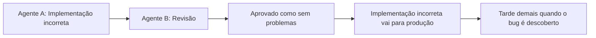

## Introdução — O Fim do Idílio do "Vibe Coding"

No início de 2025, Andrej Karpathy, co-fundador da OpenAI, propôs o conceito de "Vibe Coding": um estilo de desenvolvimento que envolve o lançamento de prompts intuitivos para a IA e a aceitação do código gerado quase sem modificações. Embora inicialmente saudado como uma revolução na produtividade, o otimismo não durou muito.

A realidade mostrada pelos dados de pesquisa é dura. Uma pesquisa de 2025 da Veracode descobriu que **45% do código gerado por IA continha vulnerabilidades de segurança**. Uma análise de 470 Pull Requests de código aberto pela CodeRabbit mostrou que o código coescrito por IA tinha **1,7 vezes mais "problemas principais"** do que o código escrito por humanos, 75% mais configurações incorretas e 2,74 vezes mais vulnerabilidades de segurança. Paradoxalmente, uma pesquisa também revelou que desenvolvedores experientes tiveram uma **redução de 19% na produtividade** ao usar ferramentas de codificação com IA (apesar de eles próprios preverem um aumento de 24%).

Qual é a causa raiz dessa situação, às vezes chamada de "ressaca do Vibe Coding"? E qual é o paradigma emergente como solução: **Spec-Driven Development (SDD)**? Este artigo explicará em detalhes, misturando artigos, estudos de caso de empresas e conhecimento prático.

---

## Razões Estruturais para o Fracasso do Vibe Coding

### O Problema da "IA que Não Lê Mentes"

O blog do GitHub expressa sucintamente este problema: "**LLMs são ótimos em completar padrões, mas não são bons em ler mentes**".

Se você pedir a um assistente de codificação de IA para "criar uma função de login", algum código de login será gerado. No entanto, se ele usará OAuth 2.0, como o gerenciamento de sessão será tratado, se ele se alinha com o esquema de banco de dados existente, como os requisitos de segurança serão atendidos — sem clareza sobre esses pontos, a IA apenas completará o código "que parece certo".

### Problema de "Shadow Bug" e Loop de Alucinação

Os problemas criados pelo Vibe Coding podem ser amplamente divididos em duas categorias.

Uma é o **Shadow Bug** (código que parece correto, mas contém vulnerabilidades graves). O código funciona e passa nos testes. No entanto, sob certas condições, pode ocorrer injeção de SQL ou ser possível contornar a autenticação. Muitos casos surgem apenas após a implantação em produção.

O outro é o **Loop de Alucinação**. Em sistemas multiagentes onde vários agentes de IA colaboram, um agente pode julgar a saída incorreta de outro agente como correta, criando um ciclo vicioso que reforça os erros um do outro. Sem um "ponto de referência para a verdade" na forma de um documento de especificação, essa cadeia não pode ser quebrada.



### Perda de Contexto e Inconsistência Arquitetônica

O contexto em conversas com IA é redefinido a cada sessão. A IA na próxima sessão não saberá que decidimos "implementar autenticação com JWT" na sessão anterior. Quando várias conversas ou vários agentes de IA estão envolvidos, o design da arquitetura geral se espalha, resultando em um sistema inconsistente onde uma parte usa REST e outra usa GraphQL.

---

## O Que é Spec-Driven Development (SDD)

### Definição e Princípios Fundamentais

Spec-Driven Development (SDD) é um paradigma de desenvolvimento que **define um documento de especificação claro (Spec) como um "contrato" para a IA, e gera código com base nesse contrato**.

Thoughtworks descreve isso da seguinte forma: "SDD utiliza especificações de requisitos claras como prompts para que agentes de IA gerem código executável. As especificações definem explicitamente o comportamento externo (mapeamento de entrada/saída, pré-condições/pós-condições, invariantes, restrições, tipos de interface)".

O princípio de "**Investir uma hora em planejamento para economizar dez horas em retrabalho**" (Thoughtworks) é mais aplicável do que nunca no desenvolvimento orientado por IA.

### Comparação Vibe Coding vs SDD

| Aspecto | Vibe Coding | Spec-Driven Development |
|:-----|:------------|:------------------------|
| Principal portador de informação | Conversa/Prompt | Arquivo de Especificação |
| Persistência do contexto | Apenas dentro da sessão | Persistente (salvo como arquivo) |
| Registro de decisões de design | Nenhum (implícito) | Documentado explicitamente |
| Instrução para IA | Prompt a cada vez | Referenciar documento de especificação |
| Alvo da revisão | Código | Documento de especificação (primeiro) → Código (depois) |
| Escala | Individual/Pequena escala | Equipe/Sistema de produção |

### Processo de 4 Fases do SDD

O **Spec Kit** (MIT License), lançado pelo GitHub em setembro de 2025, é um kit de ferramentas de código aberto para praticar SDD. Seu design define 4 fases:

**Specify (Definição de Especificação)**: Defina as jornadas do usuário e os critérios de sucesso. A IA gera um rascunho do requirements.md, mas os humanos o revisam e o finalizam.

**Plan (Planejamento Técnico)**: Declare a arquitetura, a pilha tecnológica e as restrições. A IA propõe o design.md, e os humanos decidem.

**Tasks (Decomposição de Tarefas)**: Divida em unidades de trabalho pequenas e revisáveis. A IA gera o tasks.md.

**Implement (Implementação)**: Agentes de IA implementam as tarefas enquanto os humanos verificam em cada ponto de verificação.

O ponto chave deste processo são os **pontos de verificação explícitos** em cada fase. É uma mudança de fluxo de trabalho de "Prompt and Pray" para "Specify and Verify".

---

## O Que os Artigos Revelaram

### Estudo Empírico de "Beyond the Prompt: Cursor Rules" (arXiv:2512.18925)

Um estudo conduzido por Shaokang Jiang e Daye Nam, pesquisadores da Microsoft e do GitHub, é o primeiro estudo empírico em larga escala a analisar arquivos `.cursorrules` em 401 repositórios de código aberto (a ser apresentado no MSR 2026).

A taxonomia estabelecida por este estudo classifica a forma como o contexto é fornecido aos assistentes de codificação de IA em 5 temas:

| Tema | Conteúdo |
|:-------|:-----|
| Conventions | Estilo de código, regras de nomenclatura, formatação |
| Guidelines | Padrões arquitetônicos, melhores práticas |
| Project Information | Pilha tecnológica, dependências, estrutura de diretórios |
| LLM Directives | Instruções de ação diretas para a IA (o que fazer/não fazer) |
| Examples | Exemplos concretos de padrões de código esperados |

A descoberta importante é que "**não são apenas os prompts, mas diretivas persistentes legíveis por máquina que determinam a eficácia da IA**". Arquivos de contexto persistentes, como `.cursorrules` ou `CLAUDE.md`, em vez de prompts temporários, são o que definem a qualidade dos assistentes de codificação de IA.

### Promptware Engineering: Gerenciamento do Ciclo de Vida de Especificações (arXiv:2503.02400)

O artigo "Promptware Engineering" aponta que o desenvolvimento atual de prompts está em "crise de promptware dependente de tentativa e erro" (aceito no ACM TOSEM).

A solução proposta é tratar prompts (documentos de especificação) como "artefatos de software" e gerenciá-los através do seguinte ciclo de vida:

```
Definição de Requisitos → Design → Implementação → Teste → Debugging → Evolução → Deploy → Monitoramento
```

Documentos de especificação devem ser tratados da mesma forma que o código em termos de "controle de versão, teste e melhoria contínua".

### 10 Diretrizes para Prompts de Geração de Código (arXiv:2601.13118)

A descoberta mais interessante deste estudo, identificado por meio de uma pesquisa com 50 profissionais, é que "**utilidade percebida e frequência de uso real não coincidem**".

Embora os profissionais saibam que "esclarecer as especificações de entrada/saída" e "definir pré/pós-condições" são úteis, eles na verdade não os usam. O SDD tenta resolver essa lacuna de "sabe, mas não faz" integrando-a ao fluxo de trabalho.

### Decomposição de Tarefas Multiagente e Proteção de Consistência (arXiv:2511.01149)

O artigo "Modular Task Decomposition and Dynamic Collaboration in Multi-Agent Systems" propõe um método para incorporar **análise de restrições e mecanismos de proteção de consistência** durante a decomposição de tarefas.

Ele detecta conflitos entre subtarefas antecipadamente e evita "loops de alucinação" em ambientes multiagentes. Isso se alinha diretamente com a abordagem do SDD de "tornar o documento de especificação a linguagem comum entre agentes".

---

## Engenharia de Contexto: Além do Documento de Especificações

### De Engenharia de Prompt para "Engenharia de Contexto"

Em setembro de 2025, a Anthropic definiu a evolução deste conceito em seu artigo "Effective Context Engineering for AI Agents".

**Engenharia de Contexto** é "maximizar a probabilidade de resultados desejáveis com um conjunto mínimo de tokens de alto sinal". Se a engenharia de prompt é uma técnica para "otimizar o diálogo único entre humanos e LLMs", a engenharia de contexto é a técnica para "**projetar o fluxo de informações entre agentes e o ambiente como um todo**".

A Anthropic adverte sobre o fenômeno da "**corrupção de contexto**" associado à expansão da janela de contexto. Quanto mais longo o contexto, maior o risco de o LLM não conseguir recordar com precisão as informações posteriores. Simplesmente entregar "leia todo o documento de especificação" para a IA é insuficiente; projetar para **fornecer a informação necessária no momento necessário** é crucial.

### 4 Técnicas Recomendadas

As 4 técnicas de gerenciamento de contexto recomendadas pela Anthropic são:

**Recuperação Just-in-Time**: Em vez de fornecer todo o documento de especificação de uma vez, injete dinamicamente apenas as informações necessárias para a tarefa.

**Compactação do Histórico de Conversa**: Resuma e comprima conversas longas para manter a qualidade do contexto.

**Tomada de Notas Estruturada**: Registre decisões e descobertas importantes de forma estruturada para que possam ser referenciadas em chamadas futuras de IA.

**Arquitetura de Subagentes**: Divida em agentes especializados para minimizar o contexto de cada agente.

### Princípios de Design para AGENTS.md / CLAUDE.md

"How to Write a Great agents.md" do GitHub (uma análise de mais de 2.500 repositórios) define 6 áreas centrais para arquivos de contexto eficazes:

```
1. Comandos — Comandos para executar builds, testes, linting
2. Testes — Como executar testes e a saída esperada
3. Estrutura do Projeto — Organização de diretórios e papel de cada arquivo
4. Estilo de Código — Convenções de formatação, regras de nomenclatura
5. Fluxo de Trabalho Git — Estratégia de branch, convenções de mensagem de commit
6. Limites — Sempre executar / Verificação prévia / Proibido
```

No entanto, é importante notar que um estudo de 2026 da ETH Zurich apontou que "arquivos de contexto gerados por LLM têm um efeito marginalmente negativo na taxa de sucesso de tarefas". Atualmente, a melhor prática é **limitar o que é escrito em arquivos de contexto apenas a informações que não podem ser inferidas de ferramentas ou código existente**.

---

## Prática: 6 Elementos a Incluir em um Documento de Especificação SDD

Os documentos de especificação criados no SDD devem incluir os seguintes 6 elementos como obrigatórios:

**1. Histórias de Usuário e Stakeholders**
Descreva claramente "quem" precisa de "o quê" e "por quê".

**2. Critérios de Sucesso Mensuráveis**
Defina quantitativamente, em vez de "melhorar o desempenho", use "LCP inferior a 2,5 segundos".

**3. Requisitos Funcionais e Não Funcionais**
Descreva "o que fazer" e também "o que não fazer" (restrições explícitas).

**4. Contexto Técnico e Pontos de Integração**
Especifique as interfaces com sistemas existentes e as APIs/bibliotecas a serem usadas.

**5. Pré-condições, Pós-condições e Invariantes**
Defina formalmente as restrições lógicas que a função, módulo ou sistema deve satisfazer.

```markdown
## API de Registro de Usuário (POST /api/users)

### Pré-condições
- O endereço de e-mail não deve estar registrado
- A senha deve ter pelo menos 8 caracteres

### Pós-condições
- O usuário deve ser salvo no banco de dados
- Um e-mail de confirmação deve ser enviado
- O token JWT deve estar incluído na resposta

### Invariantes
- A senha deve ser salva após hash (não em texto plano)
- O endereço de e-mail deve ser normalizado para minúsculas
```

**6. Testes de Aceitação**
Descreva "quando está completo" de forma verificável. A IA usará isso como ponto de referência para o código de teste.

### Importância de Esclarecer "Proibições"

Como destacado por antirez, autor do Redis, é importante incluir "dicas sobre soluções ruins que parecem boas" no documento de especificação.

```markdown
## Padrões Proibidos
- Uso de variáveis globais (use injeção de dependência em vez disso)
- Controle assíncrono com setTimeout (use Promises)
- Casting para tipo any (use inferência de tipo ou union)
- Acesso direto ao banco de dados (sempre passe pela camada de repositório)
```

### Mudança no Paradigma de Depuração

Depuração no SDD significa **modificar o documento de especificação**, em vez de corrigir o código. Bugs no código são sintomas de lacunas nas especificações, e a modificação da especificação será propagada para todo o código gerado para correções consistentes.

---

## O Futuro Indicado pelo Relatório de Tendências de 2026 da Anthropic

O "2026 Agentic Coding Trends Report" da Anthropic, publicado em janeiro de 2026, relata que o desenvolvimento de software está passando pela "**maior transformação desde a GUI**".

O papel do engenheiro está mudando de "quem escreve código" para "coordenador de agentes de IA". No entanto, o relatório também faz uma observação importante: **tarefas totalmente delegáveis representam apenas cerca de 0-20% do total**, e o restante requer supervisão ativa, verificação e julgamento humano.

As prioridades estratégicas listadas para 2026 são:
- Domínio da coordenação multiagente
- Escalando a supervisão humano-agente
- Incorporação de arquitetura de segurança

O que este relatório indica é que o SDD não é apenas "como escrever um documento de especificação", mas sim uma **infraestrutura organizacional e técnica para que agentes de IA e humanos colaborem com segurança**.

---

## Resumo: O Documento de Especificações é Mais Importante que o Código?

A proposição apresentada pelo SDD é provocativa: **o documento de especificação é o artefato de engenharia mais importante**.

Tradicionalmente, "escrever código" era a principal tarefa dos engenheiros. Em um mundo onde a IA pode escrever código, "definir o que escrever" se torna o valor central do engenheiro.

"A IA pode escrever código. No entanto, definir "o que deve ser construído" ainda é trabalho humano." — Essa mudança de percepção é o primeiro passo para o sucesso no desenvolvimento orientado por IA.

O princípio "Investir uma hora em planejamento para economizar dez horas em retrabalho" se tornou um dos investimentos com maior retorno em 2026. A diversão intuitiva do Vibe Coding pode se perder. No entanto, com o SDD, podemos recuperar a **confiabilidade e a previsibilidade** do código gerado por IA.

---

## Referências

| Título | Fonte | Data | URL |
|:---------|:-------|:-----|:----|
| Beyond the Prompt: An Empirical Study of Cursor Rules | MSR 2026 / arXiv | 2025-12-21 | https://arxiv.org/abs/2512.18925 |
| Promptware Engineering: Software Engineering for Prompt-Enabled Systems | ACM TOSEM / arXiv | 2025-03-04 | https://arxiv.org/abs/2503.02400 |
| Guidelines to Prompt LLMs for Code Generation | arXiv | 2026-01-19 | https://arxiv.org/abs/2601.13118 |
| Modular Task Decomposition and Dynamic Collaboration in Multi-Agent Systems | arXiv | 2025-11-03 | https://arxiv.org/abs/2511.01149 |
| Context Engineering for AI Agents in Open-Source Software | arXiv | 2025-10-24 | https://arxiv.org/abs/2510.21413 |
| Effective Context Engineering for AI Agents | Anthropic Engineering | 2025-09-29 | https://www.anthropic.com/engineering/effective-context-engineering-for-ai-agents |
| 2026 Agentic Coding Trends Report | Anthropic | 2026-01-21 | https://resources.anthropic.com/hubfs/2026%20Agentic%20Coding%20Trends%20Report.pdf |
| Spec-Driven Development with AI: Get Started with a New Open Source Toolkit | GitHub Blog | 2025-09-02 | https://github.blog/ai-and-ml/generative-ai/spec-driven-development-with-ai-get-started-with-a-new-open-source-toolkit/ |
| How to Write a Great agents.md: Lessons from Over 2,500 Repositories | GitHub Blog | 2025-11-19 | https://github.blog/ai-and-ml/github-copilot/how-to-write-a-great-agents-md-lessons-from-over-2500-repositories/ |
| Spec-Driven Development: Unpacking One of 2025's Key New AI-Assisted Engineering Practices | Thoughtworks | 2025-11 | https://www.thoughtworks.com/en-us/insights/blog/agile-engineering-practices/spec-driven-development-unpacking-2025-new-engineering-practices |
| My LLM Coding Workflow Going into 2026 | Addy Osmani | 2025-12 | https://addyosmani.com/blog/ai-coding-workflow/ |
| How to Write a Good Spec for AI Agents | Addy Osmani | 2025-10 | https://addyosmani.com/blog/good-spec/ |
| Coding with LLMs in the Summer of 2025 | antirez | 2025-07 | https://antirez.com/news/154 |
| Vibe Coding: Pros, Cons, and 2026 Forecasts | PVS-Studio | 2025-12 | https://pvs-studio.com/en/blog/posts/1338/ |
| The Evidence Against Vibe Coding: What Research Reveals About AI Code Quality | SoftwareSeni | 2026 | https://www.softwareseni.com/the-evidence-against-vibe-coding-what-research-reveals-about-ai-code-quality/ |
| Spec-Driven Development with AI Coding Agents: The Workflow Replacing "Prompt and Pray" | Java Code Geeks | 2026-03 | https://www.javacodegeeks.com/2026/03/spec-driven-developmentwith-ai-coding-agents-the-workflow-replacingprompt-and-pray.html |

---

> Este artigo foi gerado automaticamente por LLM. Pode conter erros.
