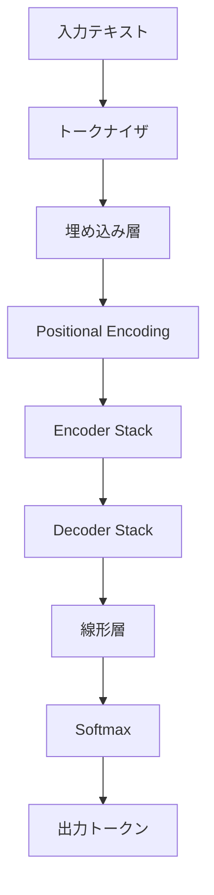
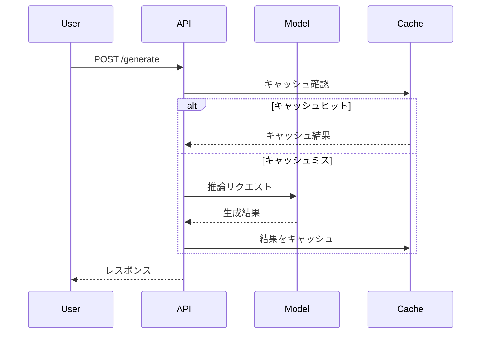
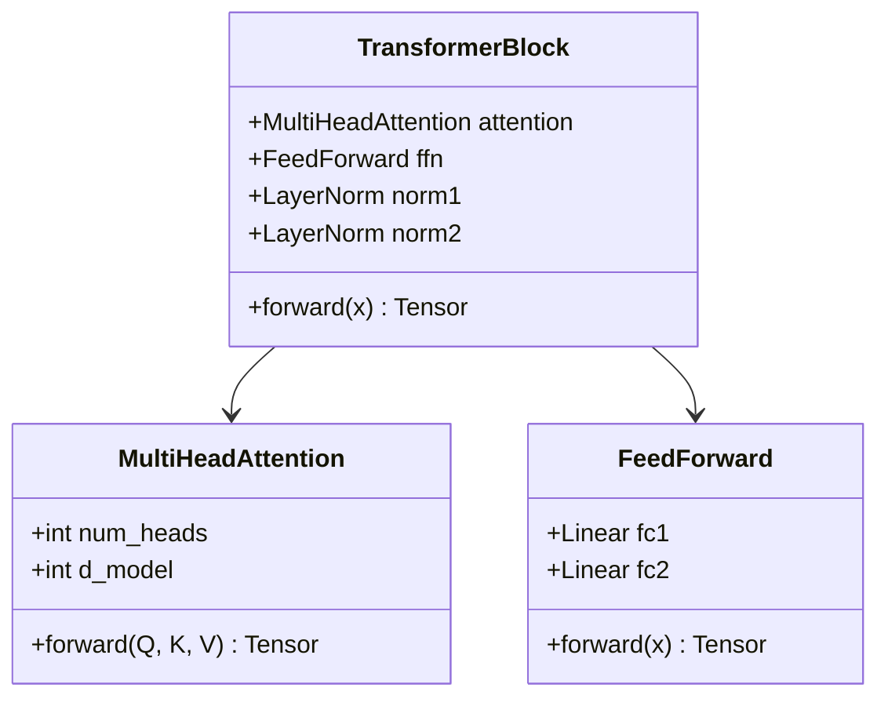
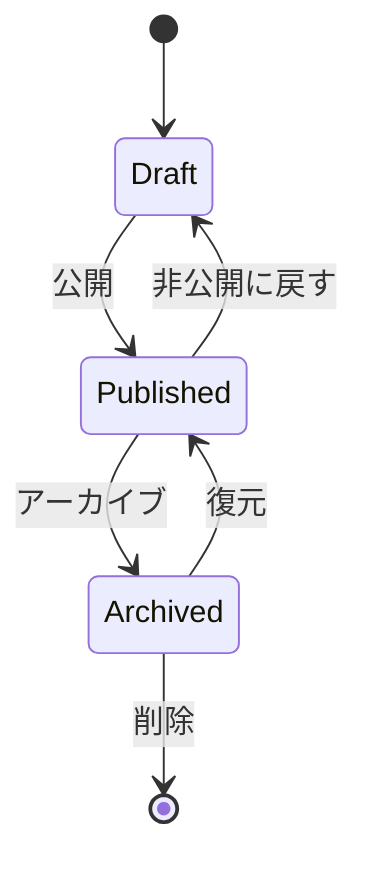

## 数式レンダリング（KaTeX）

### インライン数式

Transformer の Self-Attention は、クエリ $Q$、キー $K$、バリュー $V$ を用いて計算されます。スケーリング係数は $\sqrt{d_k}$ です。

勾配降下法では、パラメータ $\theta$ を学習率 $\alpha$ で更新します: $\theta_{t+1} = \theta_t - \alpha \nabla L(\theta_t)$

### ディスプレイ数式

Scaled Dot-Product Attention:

$$
\text{Attention}(Q, K, V) = \text{softmax}\left(\frac{QK^T}{\sqrt{d_k}}\right)V
$$

Multi-Head Attention:

$$
\text{MultiHead}(Q, K, V) = \text{Concat}(\text{head}_1, \ldots, \text{head}_h)W^O
$$

$$
\text{where } \text{head}_i = \text{Attention}(QW_i^Q, KW_i^K, VW_i^V)
$$

### 行列・ベクトル表記

ソフトマックス関数:

$$
\sigma(\mathbf{z})_i = \frac{e^{z_i}}{\sum_{j=1}^{K} e^{z_j}}
$$

交差エントロピー損失:

$$
L = -\sum_{i=1}^{N} y_i \log(\hat{y}_i)
$$

正規分布の確率密度関数:

$$
f(x) = \frac{1}{\sigma\sqrt{2\pi}} \exp\left(-\frac{(x - \mu)^2}{2\sigma^2}\right)
$$

### 場合分け

$$
\text{ReLU}(x) = \begin{cases} x & \text{if } x > 0 \\ 0 & \text{otherwise} \end{cases}
$$

### 積分・総和

$$
\int_{-\infty}^{\infty} e^{-x^2} dx = \sqrt{\pi}
$$

$$
\sum_{n=0}^{\infty} \frac{x^n}{n!} = e^x
$$

---

## Mermaid ダイアグラム

### フローチャート



### シーケンス図



### クラス図



### 状態遷移図



---

## 数式とコードの組み合わせ

バッチ正規化の計算式:

$$
\hat{x}_i = \frac{x_i - \mu_B}{\sqrt{\sigma_B^2 + \epsilon}}
$$

$$
y_i = \gamma \hat{x}_i + \beta
$$

対応する Python 実装:

```python
import torch
import torch.nn as nn

class BatchNorm(nn.Module):
    def __init__(self, num_features, eps=1e-5):
        super().__init__()
        self.gamma = nn.Parameter(torch.ones(num_features))
        self.beta = nn.Parameter(torch.zeros(num_features))
        self.eps = eps

    def forward(self, x):
        mean = x.mean(dim=0)
        var = x.var(dim=0, unbiased=False)
        x_hat = (x - mean) / torch.sqrt(var + self.eps)
        return self.gamma * x_hat + self.beta
```

> **Note**: $\gamma$ と $\beta$ は学習可能なパラメータで、正規化後のスケールとシフトを制御します。$\epsilon$ は数値安定性のための微小値です。
