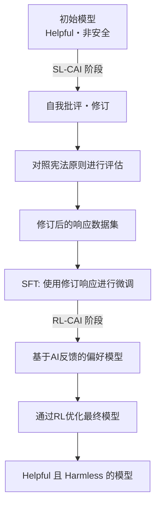

## Constitutional AI CC0公开 — AI安全性的开放化对行业提出了什么问题

### 摘要
Anthropic以CC0许可公开了Claude的行为准则“宪法”。文章探讨了从规则列表到基于原则的推理框架的技术意义，以及AI安全性的开放化将给行业带来的问题。


---


2026年1月22日，Anthropic发布了一份名为“Claude's Constitution（克劳德的宪法）”的文件。这份包含约23,000字的文件详细描述了Claude的行为原则、价值观和判断标准，并以**Creative Commons CC0 1.0**许可（即公共领域）的形式全文公开。

CC0公开意味着“任何人都可以无限制地使用、修改和采用”。AI公司将其模型训练的核心宪法文件置于公共领域，这在行业内尚属首次。

## 什么是Constitutional AI

### 源于2022年原论文的技术

Constitutional AI的概念最早于2022年12月在Anthropic发布的论文《Constitutional AI: Harmlessness from AI Feedback》（arXiv:2212.08073）中得到系统性阐述。作者是Yuntao Bai及其另外50位合著者的大型合作研究。

传统的RLHF（Reinforcement Learning from Human Feedback，基于人类反馈的强化学习）通过收集大量人类反馈来引导模型走向安全。然而，这种方法存在一个根本性问题——难以扩展。模型越强大，所需的评估人类专业知识就越高，成本呈指数级增长。

Constitutional AI提出的解决方案是“AI反馈的RLHF”，即**RLAIF（Reinforcement Learning from AI Feedback，基于AI反馈的强化学习）**。

### CAI的技术流程



**SL-CAI阶段（监督学习）**：模型自身会对照宪法原则来批评和修改其有害的响应。例如，模型会自我评估：“此响应包含种族歧视的假设，违反宪法原则X（平等对待）”，并生成修改后的响应。然后，使用修订后的响应进行微调。

**RL-CAI阶段（强化学习）**：AI会评估多个候选响应中哪一个更符合宪法原则，并构建偏好数据集。利用此数据集训练奖励模型，并通过RL优化主模型。

该方法的核心在于“将标签化所需的人类监督压缩到了一份宪法文本文件中”。AI通过参考宪法进行评估，而非直接由人类评估。这大大缓解了人力成本的扩展性问题。

### RLAIF解决的挑战

根据原论文的实验结果，应用Constitutional AI的模型在安全性方面达到了与传统RLHF模型同等甚至更高的水平。特别值得注意的是其“低有害性且不回避”的特性。

传统的安全过滤方法大多采用“拒绝危险查询”的简单方式。结果往往要么过度拒绝（高假阳性），要么容易放行（高假阴性）。而Constitutional AI使模型在理解“为何有问题”的基础上进行响应，从而能够根据上下文做出恰当的判断。

## 2026年版“Claude's Constitution”的改变

### 从规则列表到基于原则的推理

2023年发布的早期“Constitutional AI”文档，形式上更接近于一个“禁止事项”的规则列表。它明确列出禁止项，模型通过参考此列表进行检查。

2026年版在架构上有所不同。它被设计为一个具有四级优先级的综合性推理框架。

| 优先级 | 项目 | 概述 |
|---------|------|------|
| 1 | **安全性（Broadly Safe）** | 支持对AI系统进行适当的人类监督 |
| 2 | **伦理性（Generally Ethical）** | 诚实和避免有害 |
| 3 | **遵守指南（Adherent to Anthropic's Principles）** | 遵守公司的政策 |
| 4 | **有用性（Genuinely Helpful）** | 对用户和操作员提供真正支持 |

优先级的哲学含义是重要的。安全性优先于有用性，明确声明了“不应为有用性牺牲安全性”的原则。但在常规操作中，第四项有用性成为主要的评估标准——设计理念是，在不侵犯上级原则的前提下，尽可能提供最大的有用性。

此外，虽然仍明确列出了硬性约束（如禁止协助制造生物武器等绝对禁止事项），但大部分指导方针都侧重于“培养判断力”。

### 教会模型“为什么”

2026年版最值得关注的变化是详细解释了规则背后的“为什么”。

例如，“不生成暴力内容”是一项包含在许多AI安全指南中的规则。但2026年版Claude的宪法详细解释了该规则背后的价值观——尊重人的尊严、防止现实世界的伤害、以及与言论自由的权衡关系。

Anthropic的目标是构建“理解原则并能应用于未知情况的模型”，而非“死记硬背规则的模型”。这是为了应对规则未曾预料的新情况（新技术、新社会问题、新用例）不断涌现的现实。

```
【旧有方法】
IF 请求匹配禁止列表 THEN 拒绝
ELSE 响应

【基于原则的方法】
1. 此请求的意图和背景是什么？
2. 哪些原则与之相关？
3. 各原则在此情境下如何适用？
4. 如何解决原则间的权衡？
5. 总体而言，最符合伦理的响应是什么？
```

### 大规模文档公开的意义

23,000字的篇幅也值得关注。这相当于一篇短篇小说的文字量。它详细描述了价值观、判断过程以及处理棘手案例的策略，而非仅仅是表面化的规则列表。

如此详尽的程度还有一个附带效果——提高了透明度，使公司决策者和用户能够理解“Claude为何如此行事”。这也可以看作是对AI系统“黑箱”问题的一种回应。

Anthropic在文件中坦承“预期行为与模型实际行为之间存在差距”，并承诺持续评估和扩大安全研究。

## CC0公开对行业提出的问题

### AI安全性的开源实验

Constitutional AI宪法文档的CC0公开，从AI安全研究开源的角度具有重大意义。

**对研究社区的益处**：大学和研究机构可以验证、扩展和批判Anthropic的方法。安全研究应首先是“理解安全AI是什么”的共同努力，而非“谁能制造更安全AI”的竞赛——这是思想的体现。

**对其他AI公司的影响**：OpenAI、Google、Meta等竞争对手可以参考、采用和修改类似的文档。短期内看似会失去竞争优势，但如果整个行业的AI安全水平提高，就能共同赢得监管机构和社会的信任。

**对开发者社区的影响**：中小型AI公司和个人开发者可以节省从零开始设计安全框架的成本。

### “放弃竞争优势”还是“主导标准的策略”？

对CC0公开也存在批判性观点。如果竞争对手采用Claude的宪法，实际上将“Anthropic设计的安全框架”变成行业标准，这对Anthropic而言也是有利的。

标准化意味着“将自己的设计理念变为行业的实际标准”。Linux最初是为了对抗IBM和Sun Microsystems的专有UNIX而开源的，结果Linux成为了主导平台。如果Constitutional AI的CC0公开在AI安全领域引发类似的动态，那么Anthropic将成为“安全框架”领域的无名领导者。

### 仍待解决的问题

即使CC0公开，仍有一些问题未能解决。

**实施差距**：即使公开了宪法文档，如何将其整合到训练过程中的诀窍并未公开。其他公司阅读“宪法”后是否能实现同等安全性是另一回事。

**评估的难度**：用于客观衡量是否符合Claude宪法的指标并未公开。“基于原则的推理”是定性的，难以进行基准测试。

**价值观的普适性**：23,000字文档中蕴含的价值观，主要是基于英语国家/西方语境的。将这些价值观应用于全球AI系统是否恰当，仍需持续讨论。

## 在Anthropic的治理战略中的定位

Constitutional AI的CC0公开，是Anthropic更广泛透明性战略的一部分。该公司拥有一个名为“Long-Term Benefit Trust”的治理机制，并于2026年1月迎来了新成员、加州最高法院前法官Mariano-Florentino Cuéllar。在AI监管讨论日益激烈之际，吸纳法律和国际事务专家加入治理体系，是一种战略选择。

Anthropic并行追求多种安全研究方向，可解释性（Interpretability）、可扩展监控、过程导向学习、泛化理解等是其主要支柱。Constitutional AI在这些研究中被定位为“最接近实施”的部分。

Constitutional AI论文的发布（2022年）→ 早期宪法的公开（2023年）→ 修订版宪法的CC0公开（2026年1月）这一过程，展示了一个研究→实践→行业标准化的分阶段影响力扩大场景。


## 总结

Anthropic“Claude's Constitution”的CC0公开，其意义远超信息公开本身。

技术上，从规则列表到基于原则的推理框架的转变，是对AI安全实施方法论的更新。Constitutional AI与RLAIF的结合，为人类监督的成本问题提供了现实的解决方案。

战略上，AI安全框架的开放化，可以解读为Anthropic旨在主导行业标准形成的举动。选择CC0这一限制最少的许可，体现了最大化推广并促进未来分叉和采纳的意图。

社会上，作为企业方面对“AI是什么/应该如何行事”这一问题的公开回答，促进了与研究者、政策制定者和公众的对话。

在AI安全讨论从“仅是Anthropic的问题”转向“行业/全社会问题”的过程中，“Claude's Constitution”的CC0公开，将是象征这一转变的里程碑。

## 参考文献

| 标题 | 信息源 | 日期 | URL |
|:---------|:-------|:-----|:----|
| Constitutional AI: Harmlessness from AI Feedback | arXiv | 2022-12-15 | https://arxiv.org/abs/2212.08073 |
| Claude's new constitution | Anthropic | 2026-01-22 | https://www.anthropic.com/news/claude-new-constitution |
| Long-Term Benefit Trust 新成员就任 | Anthropic | 2026-01-21 | https://www.anthropic.com/news/mariano-florentino-long-term-benefit-trust |
| Constitutional AI: Anthropic的安全性研究 | Anthropic Research | 2023 | https://www.anthropic.com/research/constitutional-ai-harmlessness-from-ai-feedback |
| Anthropic's core views on AI safety | Anthropic | 2023 | https://www.anthropic.com/news/core-views-on-ai-safety |
| Creative Commons CC0 1.0 Universal | Creative Commons | — | https://creativecommons.org/publicdomain/zero/1.0/ |
| Claude's Model Specification | Anthropic | 2024 | https://www.anthropic.com/news/anthropics-model-specification |

---

> 本文由 LLM 自动生成，内容可能存在错误。
