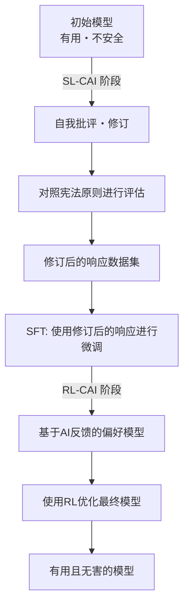
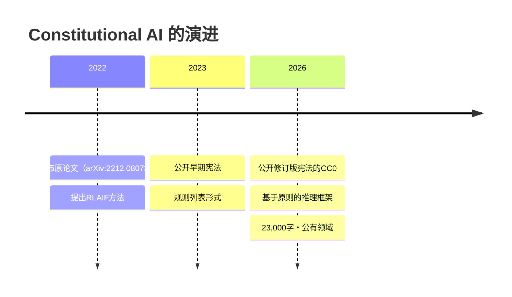

## Constitutional AI的由来

### 源自2022年的原论文的技术

Constitutional AI的概念首次由Anthropic在2022年12月发布的论文《Constitutional AI: Harmlessness from AI Feedback》（arXiv:2212.08073）中得到系统性阐述。该论文由Yuntao Bai及另外50名作者共同完成，是一项大规模的合作研究。

传统的RLHF（Reinforcement Learning from Human Feedback，基于人类反馈的强化学习）通过收集大量人类反馈来引导模型朝着安全方向发展。然而，这种方法存在一个根本性问题——难以扩展。随着模型能力的增强，评估所需的专业人类知识和成本呈指数级增长。

Constitutional AI提出的解决方案是“AI反馈的RLHF”，即**RLAIF（Reinforcement Learning from AI Feedback，基于AI反馈的强化学习）**。

### CAI的技术流程



在**SL-CAI阶段（监督学习）**，模型会参照宪法原则自行批评并修订其不安全的响应。例如，模型会自我评估：“此响应包含种族歧视的预设，违反了宪法原则X（平等对待）”，并生成修订后的响应。然后，使用修订后的响应进行微调。

在**RL-CAI阶段（强化学习）**，AI会评估多个候选响应中哪个更符合宪法原则，从而构建偏好数据集。该数据集用于训练奖励模型，并通过RL优化主模型。

该方法的核心在于“将所需的标签化人类监督压缩成了一份宪法文本文件”。AI通过参照宪法进行评估，而非人类直接评估。这大大缓解了人力成本的扩展性问题。

### RLAIF解决的挑战

原论文的实验结果表明，采用Constitutional AI的模型在安全性方面达到了与传统RLHF模型相当甚至更优的水平。特别值得注意的是其“低有害性且不过度回避”的特性。

传统的安全过滤方法常常采用“拒绝危险查询”的简单策略。其结果往往是过度拒绝（高假阳性）或放行过多（高假阴性）。Constitutional AI通过让模型理解“为什么这有问题”，从而能够根据上下文进行更恰当的判断。

## 2026年版“Claude's Constitution”的变革

### 从规则列表到基于原则的推理

2023年发布的早期“Constitutional AI”文档，在形式上更接近于“禁止事项”的规则列表。它明确列出了禁止事项，模型参照该列表进行检查。

2026年版在架构上有所不同。它被设计成一个具有四个优先级的综合性推理框架。

| 优先级 | 项目 | 概述 |
|---------|------|------|
| 1 | **安全性（Broadly Safe）** | 支持对AI系统进行适当的人类监督 |
| 2 | **伦理性（Generally Ethical）** | 诚实并避免有害 |
| 3 | **遵循指南（Adherent to Anthropic's Principles）** | 遵守公司的政策 |
| 4 | **有用性（Genuinely Helpful）** | 为用户和操作者提供真正的帮助 |

优先级的哲学含义很重要。安全性优先于有用性，明确声明了“不应为了有用性而牺牲安全性”的原则。然而，在日常运营中，第四项有用性是主要的评估轴——其设计理念是在不侵犯更高优先级原则的前提下，最大限度地实现有用性。

此外，虽然仍然明确了硬性约束（如禁止协助制造生物武器等绝对禁止事项），但大部分指导方针都侧重于“培养判断力”。

### 教授模型“为什么”

2026年版最显著的变化在于详细解释了规则背后的“为什么”。

例如，“不生成暴力内容”是许多AI安全指南中都包含的规则。但2026年版的Claude宪法却会详细解释该规则背后的价值观——尊重人的尊严、防止现实世界的伤害、与言论自由的紧张关系等。

Anthropic的目标是培养“理解原则并能适用于未知情况的模型”，而非“死记硬背规则的模型”。这是为了应对规则无法预设的新情况（新技术、新社会问题、新用例）不断涌现的现实。

```
【传统方法】
IF 请求匹配禁止列表 THEN 拒绝
ELSE 响应

【基于原则的方法】
1. 该请求的意图和上下文是什么？
2. 哪些原则相关？
3. 各原则在此情况下如何适用？
4. 如何解决原则间的权衡？
5. 总体而言，最符合伦理的响应是什么？
```

### 大规模文档公开的意义

23,000字的篇幅也值得关注。这相当于一篇短篇小说的文本量。它详细描述了价值观念、判断过程以及如何应对难以判断的情况，而非仅仅是表面化的规则列表。

如此详尽的描述还带来了副次效应——提高了透明度，使企业决策者和用户能够理解“Claude为何如此行事”。这可以被视为对AI系统“黑箱”问题的一种回应。

Anthropic在文档中坦承“预期行为与模型实际行为之间存在差距”，并承诺将持续评估并扩展安全研究。

## CC0公开对行业的挑战

### AI安全性的开源实验

以CC0许可公开Constitutional AI的宪法文档，在AI安全研究的开源化方面具有重要意义。

**对研究社区的贡献**：大学和研究机构可以验证、扩展和批判Anthropic的方法。安全研究不应仅是“谁能做出更安全AI的竞赛”，而应是“理解安全AI是什么”的共同努力，CC0公开体现了这一思想。

**对其他AI公司的影响**：OpenAI、Google、Meta等竞争对手可以参考、采用和修改类似的文档。虽然短期内可能看似丧失竞争优势，但如果整个行业的AI安全水平得到提升，将能共同赢得监管机构和社会信任。

**对开发者社区的影响**：中小型AI公司和个人开发者可以节省从零开始设计安全框架的成本。

### “放弃竞争优势”还是“主导标准的策略”？

对于CC0公开也存在批评的声音。如果竞争对手采用了Claude的宪法，那么“Anthropic设计的安全框架”实际上可能成为行业标准，这对Anthropic而言也是有利的局面。

标准化也意味着“将自己的设计理念变成行业的默认”。Linux最初是为了对抗IBM和Sun Microsystems的专有UNIX而开源的，结果Linux成为了支配性平台。如果Constitutional AI的CC0公开在AI安全领域引发类似的动态，那么Anthropic将成为“安全框架”领域的无冕之王。

### 仍待解决的问题

CC0公开也未能解决一些问题。

**实施差距**：即使公开了宪法文档，如何将其整合到训练过程中仍然是未公开的知识。其他公司阅读“宪法”后能否实现同等的安全性是另一回事。

**评估的难度**：没有公开客观衡量Claude的宪法是否合规的指标。“基于原则的推理”是定性的，难以进行基准测试。

**价值观的普适性**：23,000字文档中蕴含的价值观主要基于英语圈和西方语境。将这些价值观应用于全球AI系统是否合适，仍需要持续讨论。

## 在Anthropic的治理战略中的定位

Constitutional AI的CC0公开是Anthropic更广泛透明度战略的一部分。该公司拥有一个名为“Long-Term Benefit Trust”的治理机制，并于2026年1月迎来了加州最高法院前法官Mariano-Florentino Cuéllar先生作为新成员。在AI监管讨论日益激烈之际，将法律和国际问题专家纳入治理体系是其战略选择。

Anthropic正并行追求多种安全研究方向，其中可解释性（Interpretability）、可扩展监控、过程导向学习和泛化理解是主要支柱。Constitutional AI在这项研究中属于“最接近落地”的部分。

Constitutional AI论文的发布（2022年）→ 早期宪法的公开（2023年）→ 修订版宪法的CC0公开（2026年1月）这一过程，展示了研究→实践→行业标准化的渐进式影响力扩张的设想。



## 总结

Anthropic公开“Claude's Constitution”的CC0许可，其意义远不止于信息公开。

从技术层面看，从规则列表向基于原则的推理框架的转变，是AI安全实施方法论本身的更新尝试。Constitutional AI与RLAIF的结合，为解决人类监督成本问题提供了切实可行的方案。

从战略层面看，AI安全框架的开放化，可以解读为Anthropic旨在主导行业标准形成的举动。选择CC0这一限制最少的许可，表明其意图在于最大化推广并促进未来的分支和采用。

从社会层面看，作为企业对“什么是AI、应该如何行动”这一问题的公开回应，它促进了与研究人员、政策制定者和公众的对话。

随着AI安全讨论从“Anthropic的专属问题”转向“行业和社会整体的问题”，Constitutional AI的CC0公开将成为象征这一转变的一个里程碑。

## 参考文献

| Title | Source | Date | URL |
|:---------|:-------|:-----|:----|
| Constitutional AI: Harmlessness from AI Feedback | arXiv | 2022-12-15 | https://arxiv.org/abs/2212.08073 |
| Claude's new constitution | Anthropic | 2026-01-22 | https://www.anthropic.com/news/claude-new-constitution |
| Long-Term Benefit Trust New Member Appointment | Anthropic | 2026-01-21 | https://www.anthropic.com/news/mariano-florentino-long-term-benefit-trust |
| Constitutional AI: Anthropic's Safety Research | Anthropic Research | 2023 | https://www.anthropic.com/research/constitutional-ai-harmlessness-from-ai-feedback |
| Anthropic's core views on AI safety | Anthropic | 2023 | https://www.anthropic.com/news/core-views-on-ai-safety |
| Creative Commons CC0 1.0 Universal | Creative Commons | — | https://creativecommons.org/publicdomain/zero/1.0/ |
| Claude's Model Specification | Anthropic | 2024 | https://www.anthropic.com/news/anthropics-model-specification |

---

> 本文由 LLM 自动生成，内容可能存在错误。
