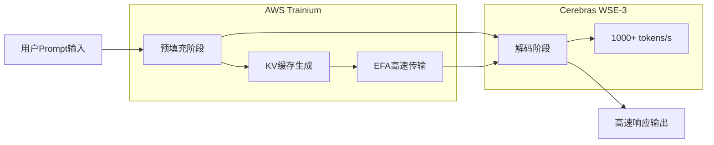

### 标题
Cerebras×OpenAI: GPU独占からの脱却とAIインフラ多様化の現実

### 要旨
OpenAIがCerebrasのWSE-3ウェーハスケールチップを採用し、毎秒1,000トークン超えの超高速推論を実現。100億ドル規模の契約はNVIDIA独占体制への挑戦であり、AIインフラの競争地図を塗り替える歴史的転換点となっている。

### 正文

在AI基础设施的历史上，2026年初头将被铭记为一个转折点。OpenAI与Cerebras签订了超过100亿美元的合同，首次大规模将非NVIDIA GPU的推理加速器投入生产环境。其象征是“GPT-5.3-Codex-Spark”——一个以超过每秒1000token的速度运行的代码专属模型。

这一举措不仅仅是采购方的改变。它意味着长期以来垄断AI硬件市场的NVIDIA的堡垒，被引入了本质性的竞争。本文将详细阐述Cerebras WSE-3架构的技术细节、与OpenAI签订合同的背景，以及AI基础设施多元化将为整个产业带来的影响。

## Cerebras WSE-3: 晶圆级引擎的革新

### 与传统GPU架构的根本性差异

支撑当今AI推理的许多GPU，其架构是将硅晶圆切割成独立的芯片（晶圆切割），然后将多块芯片通过网络连接实现并行处理。NVIDIA的H100和B200就是典型例子，它们通过NVLink等高速互连连接多块芯片来实现横向扩展。

Cerebras选择的方法颠覆了这一常识。WSE（Wafer Scale Engine）将整个晶圆作为一个巨大的芯片来运行。由于不进行物理切割，芯片间通信的开销原理上就不存在。

### WSE-3的主要规格

WSE-3采用TSMC 5nm工艺制造，拥有以下规格：

| 规格项 | WSE-3 | NVIDIA H100 | 比较倍率 |
|:---------|:------|:------------|:---------|
| 晶体管数量 | 4兆个 | 约800亿个 | 约50倍 |
| AI核心数 | 900,000个 | 17,408个 | 约52倍 |
| 片上SRAM | 44 GB | 50 MB | 约880倍 |
| 内存带宽 | 21 PB/s | 3.35 TB/s | 约7,000倍 |
| 芯片面积 | 46,255 mm² | 814 mm² | 约57倍 |
| 峰值计算性能 | 125 PFLOPS | 3.958 PFLOPS | 约32倍 |

值得一提的是片上SRAM的容量。WSE-3的44 GB相当于H100的880倍。在AI推理中，内存带宽往往会成为瓶颈，通过在片上集成大容量内存可以最大限度地减少访问芯片外内存的次数。这是高速推理的根本原因。

### 晶圆级带来的推理速度

WSE-3的900,000个核心全部以2D网状拓扑均匀连接。这种架构极大地加速了Token生成过程中的“解码”阶段。

普通的GPU集群进行AI推理时，需要在多个GPU之间传输模型的权重数据。在WSE-3中，所有权重都展开在片上SRAM上，无需访问外部内存，从而实现了每秒数千Token的高吞吐量。

## OpenAI与Cerebras的100亿美元合同

### 合同概述

2026年1月，OpenAI与Cerebras签订了多年合同，承诺在2028年前提供750兆瓦的计算资源。合同总额超过100亿美元，对于Cerebras的业务规模而言，这是一笔变革性的交易。

据Cerebras CEO Andrew Feldman介绍，谈判的契机可以追溯到前一年8月。Cerebras成功演示了在自家的芯片上比GPU更高效地运行OpenAI的开源模型。这次技术演示为这笔巨额合同打开了大门。

对OpenAI而言，这份合同是其采购多元化战略的核心。OpenAI在维持与现有NVIDIA、AMD、Broadcom的订单的同时，又增加了与Cerebras价值100亿美元的专用推理计算采购。“AI基础设施风险分散”这一战略性决策在此得到了体现。

### GPT-5.3-Codex-Spark: 首个量产成果

2026年2月，OpenAI发布了此次合作的首个成果——“GPT-5.3-Codex-Spark”。这款模型是GPT-5.3-Codex的轻量级版本，专为实时编码优化，具有以下特点：

*   **推理速度**: 每秒1,000Token以上（约为GPT-5.3-Codex的15倍）
*   **上下文窗口**: 128k（仅文本）
*   **支持环境**: ChatGPT Pro、Codex应用、CLI、VS Code扩展
*   **提供形式**: 研究预览（分阶段推出）

每秒1,000Token这个数字可能难以直观理解，但与GPT-5.3-Codex的约65-70Token/秒相比，这意味着AI在开发者打字的速度就能完成补全/生成。这是对编码“交互性”的革命性速度改变。

### 为何编码是首个用例？

OpenAI选择将Cerebras芯片首先应用于编码（代理式编码）领域，这在战略上是合理的。

编码助手的生产力强烈依赖于响应速度。当开发者在编写代码时获得实时补全，即使是几百毫秒的延迟也会打断他们的专注力。在AI代理执行测试、修复bug、重构代码的代理式工作流程中，这种速度的重要性更加凸显。

Cerebras的晶圆级芯片提供的超高速推理，为该领域带来了最直接的价值，因此被选为首个用例。

## NVIDIA垄断地位被打破的结构性背景

### AI基础设施中的NVIDIA统治地位

过去五年，AI训练和推理市场几乎被NVIDIA垄断。以H100、A100为核心的GPU成为了所有主要云服务提供商和大型AI实验室的标准基础设施，强大的CUDA生态系统锁定了竞争对手的进入。

这种垄断地位对OpenAI也构成了限制。依赖单一供应商存在以下风险：

*   **丧失价格谈判力**: NVIDIA在定价方面拥有强大的优势
*   **供应瓶颈**: GPU短缺制约AI服务的扩展
*   **单点故障**: NVIDIA的生产和供应问题直接转化为业务风险

### OpenAI的多元化战略

OpenAI从2025年开始全面推行采购多元化。在维持与NVIDIA现有合同的同时，扩大了对AMD、Broadcom以及Cerebras的采购。与Cerebras的100亿美元合同，更是其中针对推理工作负载的战略性投资。

值得注意的是，Cerebras芯片的采用是“推理加速”专用，而非“通用计算”。根据Deloitte的预测，到2026年，推理将占AI计算总量的约三分之二（2025年时约占50%），对推理加速器的需求将进一步扩大。

### AWS与Cerebras的合作：向云端的扩散

在与OpenAI签约约两个月后的2026年3月13日，AWS与Cerebras宣布了重要合作。在AWS Bedrock中引入WSE-3芯片的“分离式推理架构（Disaggregated Inference Architecture）”的部署。

技术上，采用混合配置，AWS的Trainium处理器负责预填充（Prompt处理）阶段，Cerebras CS-3负责解码（输出生成）阶段。据称，通过这种分工，在相同的硬件占地面积下可以实现5倍的Token容量。

这种“分离式推理”架构的理念是利用各阶段计算特性的差异。预填充由擅长并行处理的GPU类负责，解码由拥有大容量片上内存的WSE-3负责，从而最大化整体吞吐量。

## Cerebras的公司战略与IPO

### 增长至22亿美元估值

Cerebras在2024年的估值为80亿美元，但随着与OpenAI签约以及获得多个大型客户（IBM、美国能源部等），到2026年初，其估值已报告超过220亿美元。2025年的估计销售额超过10亿美元，已从一个单纯的研究阶段的初创公司成熟为拥有实际收入的基础设施企业。

### IPO计划及其历程

Cerebras于2025年底提交了IPO申请，但由于与阿布扎比G42的资本关系问题，受到CFIUS（美国外国投资委员会）审查，不得不暂时撤回。之后，G42从投资者名单中移除并获得了CFIUS的批准，计划于2026年第二季度进行重新申请。

与OpenAI和AWS的巨额合同，为IPO前的业务业绩提供了绝佳的背景。

## AI基础设施多极化预示的未来

### “最快推理”竞争的爆发

GPT-5.3-Codex-Spark的发布为AI行业带来了新的竞争轴。模型“智能”之外，“速度”成为了主要的差异化因素。

如果Cerebras声称的20倍速度优势（相对于NVIDIA GPU）得到证实，AI服务提供商将进入根据用途选择硬件的时代。

*   **需要高精度的任务**: 传统GPU（NVIDIA H100/B200等）
*   **需要超低延迟的任务**: Cerebras WSE-3
*   **成本效益优先的任务**: AMD MI300X、定制ASIC等

### 对NVIDIA的影响

NVIDIA的市场支配地位不会动摇，但正在发生重要变化。在推理市场，NVIDIA正面临其强大的竞争对手的真正竞争。 

尤其值得关注的是，OpenAI、AWS、Cerebras的组合所展现的“生态系统建设”的动向。正如CUDA多年来是选择GPU的实际理由一样，一个专门针对推理的新生态系统正在形成。

### 开发者体验的变革

超高速推理带来的变化不仅仅是性能指标的改进。Spotify报告称，自2025年12月以来，AI编码工具的普及使得顶尖工程师“不再编写代码”。Claude Code和GPT-5.3-Codex-Spark等超高速AI编码工具将进一步加速这种转变。

每秒1,000Token的推理速度，可能成为从根本上改变开发者与AI协作模式的阈值。实时思维补全、即时代码审查、瞬间调试建议——如果这些都能无等待地提供，软件开发的生产力将得到数量级的提升。

## 总结

Cerebras WSE-3与OpenAI的合作，为AI推理基础设施带来了三个重要转折。

第一，作为技术转折，晶圆级架构确立了“每秒1,000Token”的全新性能标准。第二，作为产业结构转折，从NVIDIA一家独大向多极化转变已全面开始。第三，作为竞争轴转折，除了模型的“智能”之外，推理“速度”已确立为主要的差异化要素。

AWS合作所展示的“分离式推理架构”，预示着进一步的普及。如果到2026年普通云用户能够通过Amazon Bedrock获得WSE-3的优势，那么高速推理将从少数大型实验室的特权，转变为标准AI服务的组成部分。

NVIDIA多年构建的生态系统壁垒很高。然而，100亿美元的合同、与AWS的战略合作，以及开发者实际可体验到的15倍速度优势——当这些叠加在一起时，AI基础设施的竞争地图正在被切实地重绘。

---

## 参考文献

| Title | Source | Date | URL |
|:---------|:-------|:-----|:----|
| OpenAI deploys Cerebras chips for 15x faster code generation | VentureBeat | 2026年2月12日 | https://venturebeat.com/technology/openai-deploys-cerebras-chips-for-15x-faster-code-generation-in-first-major |
| Cerebras Inks Transformative \$10 Billion Inference Deal With OpenAI | NextPlatform | 2026年1月15日 | https://www.nextplatform.com/2026/01/15/cerebras-inks-transformative-10-billion-inference-deal-with-openai/ |
| OpenAI signs deal, worth \$10B, for compute from Cerebras | TechCrunch | 2026年1月14日 | https://techcrunch.com/2026/01/14/openai-signs-deal-reportedly-worth-10-billion-for-compute-from-cerebras/ |
| Introducing GPT-5.3-Codex-Spark | OpenAI Official | 2026年2月 | https://openai.com/index/introducing-gpt-5-3-codex-spark/ |
| OpenAI GPT-5.3-Codex-Spark Now Running at 1K Tokens Per Second | ServeTheHome | 2026年2月 | https://www.servethehome.com/openai-gpt-5-3-codex-spark-now-running-at-1k-tokens-per-second-on-big-cerebras-chips/ |
| Cerebras WSE-3 AI Chip Launched 56x Larger than NVIDIA H100 | ServeTheHome | 2024年3月 | https://www.servethehome.com/cerebras-wse-3-ai-chip-launched-56x-larger-than-nvidia-h100-vertiv-supermicro-hpe-qualcomm/ |
| AWS and Cerebras Collaboration Aims to Set a New Standard for AI Inference | BusinessWire | 2026年3月13日 | https://www.businesswire.com/news/home/20260313406341/en/AWS-and-Cerebras-Collaboration-Aims-to-Set-a-New-Standard-for-AI-Inference-Speed-and-Performance-in-the-Cloud |
| Cerebras scores OpenAI deal worth over \$10 billion ahead of IPO | CNBC | 2026年1月14日 | https://www.cnbc.com/2026/01/14/cerebras-scores-openai-deal-worth-over-10-billion.html |
| OpenAI chip deal with Cerebras adds to roster of Nvidia, AMD, Broadcom | CNBC | 2026年1月16日 | https://www.cnbc.com/2026/01/16/openai-chip-deal-with-cerebras-adds-to-roster-of-nvidia-amd-broadcom.html |
| OpenAI Partners with Cerebras to Bring High-Speed Inference to the Mainstream | Cerebras Blog | 2026年2月 | https://www.cerebras.ai/blog/openai-partners-with-cerebras-to-bring-high-speed-inference-to-the-mainstream |
| A Comparison of the Cerebras Wafer-Scale Integration Technology with Nvidia GPU-based Systems | arXiv | 2025年3月 | https://arxiv.org/html/2503.11698v1 |
| Cerebras is coming to AWS | Cerebras Blog | 2026年3月 | https://www.cerebras.ai/blog/cerebras-is-coming-to-aws |
| 2026 IPO Alert: Nvidia Rival Cerebras Systems Targets Debut in Q2 | TipRanks | 2026年1月 | https://www.tipranks.com/news/2026-ipo-alert-nvidia-rival-cerebras-targets-debut-in-q2 |

---

> 本文由 LLM 自动生成，内容可能存在错误。
