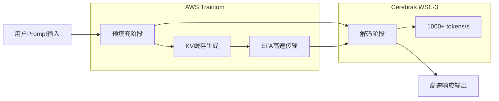

### 标题
Cerebras×OpenAI：摆脱GPU垄断，AI基础设施多元化的现实

### 摘要
OpenAI采用Cerebras的WSE-3晶圆级芯片，实现超每秒1000 Token的超高速推理。该笔100亿美元规模的合同是对NVIDIA垄断地位的挑战，正在重塑AI基础设施的竞争格局，标志着历史性的转折点。

### 标签
["Cerebras","OpenAI","AI推理","AI基础设施","NVIDIA","GPU架构","晶圆级"]

### 正文

在AI基础设施的历史上，2026年初将会被铭记为一个重要的转折点。OpenAI与Cerebras签署了一份价值超过100亿美元的合同，首次大规模将非NVIDIA GPU的推理加速器引入生产环境。其标志性成果是“GPT-5.3-Codex-Spark”——一个专注于编码、运行速度超过每秒1000 Token的模型。

这一举措不仅仅是采购渠道的改变。它意味着AI硬件市场长期以来由NVIDIA占据的主导地位，现在将迎来实质性的竞争。本文将详细阐述Cerebras WSE-3架构的技术细节、OpenAI与Cerebras签订合同的背景，以及AI基础设施多元化对整个产业带来的影响。

## Cerebras WSE-3：晶圆级引擎的革新

### 与传统GPU架构的根本区别

支撑当今AI推理的许多GPU，其架构是将硅晶圆切割成独立的芯片（晶圆切割），然后通过网络连接多片芯片来实现并行处理。NVIDIA的H100和B200就是典型代表，它们通过NVLink等高速互连技术连接多颗芯片来实现横向扩展（Scale-out）。

Cerebras选择的方法则颠覆了这一常识。WSE（Wafer Scale Engine）将整个晶圆作为一个巨大的芯片来运行。由于不进行物理切割，理论上消除了芯片间通信的开销。

### WSE-3的主要规格

WSE-3采用TSMC 5nm工艺制造，拥有以下规格：

| 规格项目       | WSE-3          | NVIDIA H100     | 比较倍率 |
| -------------- | -------------- | --------------- | -------- |
| 晶体管数量     | 4兆个          | 约800亿个       | 约50倍   |
| AI核心数量     | 900,000个      | 17,408个        | 约52倍   |
| 片上SRAM       | 44 GB          | 50 MB           | 约880倍  |
| 内存带宽       | 21 PB/s        | 3.35 TB/s       | 约7,000倍 |
| 芯片面积       | 46,255 mm²     | 814 mm²         | 约57倍   |
| 峰值计算性能   | 125 PFLOPS     | 3.958 PFLOPS    | 约32倍   |

特别值得一提的是片上SRAM的容量。WSE-3的44 GB相当于H100的880倍。在AI推理中，内存带宽常常是瓶颈，通过在片上集成大容量内存，可以将芯片外部内存的访问降至最低。这是实现高速推理的根本原因。

### 晶圆级实现的高速推理

WSE-3的900,000个核心全部以2D网格拓扑结构均匀连接。这种架构极大地加速了Token生成中的“解码”阶段。

当传统的GPU集群进行AI推理时，需要在多个GPU之间传输模型的权重数据。而在WSE-3中，所有权重都部署在片上SRAM上，无需访问外部内存，从而实现了每秒数千Token的高吞吐量。

## OpenAI与Cerebras的100亿美元合同

### 合同概述

2026年1月，OpenAI与Cerebras签署了一份多年合同，承诺在2028年前提供750兆瓦的计算资源。合同总额超过100亿美元，对于Cerebras的业务规模而言，这是一笔变革性的交易。

据Cerebras首席执行官Andrew Feldman称，此次谈判始于前一年8月。当时Cerebras成功演示了在自家的芯片上比GPU更高效地运行OpenAI的开源模型。这次技术演示为达成大额合同打开了大门。

对OpenAI而言，这笔合同是其采购多元化战略的核心。OpenAI在维持对NVIDIA、AMD、Broadcom现有订单的同时，额外增加了与Cerebras价值100亿美元的专用推理计算采购。“AI基础设施风险分散”的战略决策体现在其中。

### GPT-5.3-Codex-Spark：首个规模化成果

2026年2月，OpenAI发布了此次合作的首个成果“GPT-5.3-Codex-Spark”。这款模型被设计为GPT-5.3-Codex的轻量级版本，专为实时编码优化，具有以下特点：

*   **推理速度**: 每秒1000 Token以上（约是GPT-5.3-Codex的15倍）
*   **上下文窗口**: 128k（仅文本）
*   **支持环境**: ChatGPT Pro、Codex应用、CLI、VS Code扩展
*   **提供形式**: 研究预览（分阶段推出）

每秒1000 Token这个数字虽然直观上难以理解，但与GPT-5.3-Codex运行速度约为每秒65-70 Token相比，这意味着AI可以比开发者打字更快地完成代码补全和生成。这是一种从根本上改变编码“交互性”的速度。

### 为何编码是首个用例

OpenAI首次将Cerebras芯片应用于编码（代理式编码）领域，这在战略上是明智的。

编码助手的生产力高度依赖于响应速度。当开发者一边编写代码一边接收实时补全时，即使是几百毫秒的延迟也会打断他们的注意力。在AI代理执行测试、修复bug、重构代码的代理式工作流程中，这种速度的重要性进一步提升。

Cerebras的晶圆级芯片所提供的高速推理，能够为这一领域带来最直接的价值，因此被选为首个用例。

## NVIDIA垄断地位被打破的结构性背景

### AI基础设施中的NVIDIA统治地位

在过去的五年里，AI训练和推理市场几乎被NVIDIA垄断。以H100、A100为核心的GPU已成为所有主要云服务提供商和大型AI实验室的标准基础设施，而CUDA生态系统的强大锁定效应也使得竞争对手难以进入。

这种垄断地位对OpenAI来说也是一种制约。依赖单一供应商存在以下风险：

*   **丧失价格谈判力**: NVIDIA在定价方面拥有强大的优势。
*   **供应瓶颈**: GPU短缺限制了AI服务的扩展。
*   **单点故障**: NVIDIA的制造和供应问题直接构成业务风险。

### OpenAI的多元化战略

OpenAI从2025年开始本格化其采购多元化战略。在维持与NVIDIA现有合同的同时，也扩大了对AMD、Broadcom以及Cerebras的采购。与Cerebras价值100亿美元的合同，更是其中针对推理工作负载的战略性投资。

值得注意的是，Cerebras芯片的采用并非出于“通用计算”的考虑，而是“推理加速”的专用应用。根据Deloitte的预测，到2026年，推理将占AI计算总量的约三分之二（2025年时约占50%），对推理加速器的需求将持续增长。

### AWS与Cerebras的合作：向云端渗透

在与OpenAI签约后约两个月，即2026年3月13日，AWS与Cerebras宣布了一项重要合作。他们将在AWS Bedrock中引入WSE-3芯片，部署“分离式推理架构（Disaggregated Inference Architecture）”。

技术上，该架构采用混合配置，AWS的Trainium处理器负责预填充（Prompt处理）阶段，而Cerebras CS-3负责解码（输出生成）阶段。通过这种分工，可以在相同的硬件占地面积上实现5倍的Token容量。

这种“分离式推理”架构的理念，在于利用各阶段计算特性的差异。预填充阶段擅长并行处理，适合GPU系；而解码阶段拥有大容量片上内存，适合WSE-3，从而最大化整体吞吐量。

## Cerebras的企业战略与IPO

### 增长至22亿美元估值

Cerebras在2024年估值达到80亿美元，而在OpenAI合同及IBM、美国能源部等多个大型客户的获取下，到2026年初，其估值已报告超过220亿美元。2025年的预计收入超过10亿美元，它已从一个单纯的研究阶段的初创公司，成熟为一个拥有实际收入的基础设施企业。

### IPO计划及其进展

Cerebras曾计划在2025年底申请IPO，但由于与阿布扎比的G42的股权关系受到CFIUS（美国外国投资委员会）审查，不得不暂时撤回。之后，G42从投资者名单中移除，并获得了CFIUS的批准，计划在2026年第二季度重新提交申请。

与OpenAI和AWS的大型合同，为其IPO前提供了充分的业务业绩背景。

## AI基础设施的多极化所预示的未来

### “最快推理”竞争的爆发

GPT-5.3-Codex-Spark的发布为AI行业带来了新的竞争维度。除了模型的“智能”之外，“速度”也作为差异化因素被推到了台前。

如果Cerebras所声称的20倍速度优势（相较于NVIDIA GPU）得到证实，AI服务提供商将进入根据应用场景选择硬件的时代。

*   **需要高精度的任务**: 传统GPU（NVIDIA H100/B200等）
*   **需要超低延迟的任务**: Cerebras WSE-3
*   **成本效益优先的任务**: AMD MI300X、定制ASIC等

### 对NVIDIA的影响

虽然NVIDIA的市场主导地位不会动摇，但正在发生重要的变化。在推理市场，NVIDIA正面临着真正的强大竞争对手。 

特别值得关注的是，OpenAI、AWS、Cerebras的组合所展示的“生态系统建设”动向。正如CUDA多年来一直是选择GPU的实际理由一样，一个针对推理优化的新生态系统正在形成。

### 开发者体验的转变

超高速推理带来的变化，不仅仅是性能指标的改进。据报道，Spotify在2025年12月后，由于AI编码工具的普及，顶尖工程师已不再“编写代码”。Claude Code和GPT-5.3-Codex-Spark等超高速AI编码工具将进一步加速这一转变。

每秒1000 Token的推理速度，可能成为从根本上改变开发者与AI协作模式的门槛。实时思考补全、即时代码审查、瞬时调试建议——如果这些能够无延迟地提供，软件开发的生产力将呈指数级增长。

## 总结

Cerebras WSE-3与OpenAI的合作，为AI推理基础设施带来了三个重要转变：

第一，作为技术性转变，晶圆级架构树立了“每秒1000 Token”这一新的性能标杆。第二，作为产业结构性转变，从NVIDIA一家独大向多极化转移正式启动。第三，作为竞争轴的转变，推理“速度”与模型“智能”并列，成为主要的差异化要素。

AWS合作所展示的“分离式推理架构”，预示着进一步的普及。如果到2026年，普通云用户能通过Amazon Bedrock体验到WSE-3的优势，那么高速推理将从少数大型实验室的特权，转变为标准AI服务的组成部分。

NVIDIA多年构建的生态系统壁垒很高。然而，100亿美元的合同、与AWS的战略合作，以及开发者实际能体验到的15倍速度优势——当这些叠加在一起时，AI基础设施的竞争格局正在被切实地改写。

---

## 参考文献

| Title                                                                          | Source         | Date         | URL                                                                                                                      |
| :----------------------------------------------------------------------------- | :------------- | :----------- | :----------------------------------------------------------------------------------------------------------------------- |
| OpenAI deploys Cerebras chips for 15x faster code generation                   | VentureBeat    | 2026年2月12日 | https://venturebeat.com/technology/openai-deploys-cerebras-chips-for-15x-faster-code-generation-in-first-major                |
| Cerebras Inks Transformative \$10 Billion Inference Deal With OpenAI           | NextPlatform   | 2026年1月15日 | https://www.nextplatform.com/2026/01/15/cerebras-inks-transformative-10-billion-inference-deal-with-openai/                |
| OpenAI signs deal, worth \$10B, for compute from Cerebras                      | TechCrunch     | 2026年1月14日 | https://techcrunch.com/2026/01/14/openai-signs-deal-reportedly-worth-10-billion-for-compute-from-cerebras/                 |
| Introducing GPT-5.3-Codex-Spark                                                | OpenAI Official| 2026年2月    | https://openai.com/index/introducing-gpt-5-3-codex-spark/                                                                  |
| OpenAI GPT-5.3-Codex-Spark Now Running at 1K Tokens Per Second                 | ServeTheHome   | 2026年2月    | https://www.servethehome.com/openai-gpt-5-3-codex-spark-now-running-at-1k-tokens-per-second-on-big-cerebras-chips/         |
| Cerebras WSE-3 AI Chip Launched 56x Larger than NVIDIA H100                    | ServeTheHome   | 2024年3月    | https://www.servethehome.com/cerebras-wse-3-ai-chip-launched-56x-larger-than-nvidia-h100-vertiv-supermicro-hpe-qualcomm/ |
| AWS and Cerebras Collaboration Aims to Set a New Standard for AI Inference Speed and Performance in the Cloud | BusinessWire   | 2026年3月13日 | https://www.businesswire.com/news/home/20260313406341/en/AWS-and-Cerebras-Collaboration-Aims-to-Set-a-New-Standard-for-AI-Inference-Speed-and-Performance-in-the-Cloud |
| Cerebras scores OpenAI deal worth over \$10 billion ahead of IPO                | CNBC           | 2026年1月14日 | https://www.cnbc.com/2026/01/14/cerebras-scores-openai-deal-worth-over-10-billion.html                                       |
| OpenAI chip deal with Cerebras adds to roster of Nvidia, AMD, Broadcom         | CNBC           | 2026年1月16日 | https://www.cnbc.com/2026/01/16/openai-chip-deal-with-cerebras-adds-to-roster-of-nvidia-amd-broadcom.html                    |
| OpenAI Partners with Cerebras to Bring High-Speed Inference to the Mainstream  | Cerebras Blog  | 2026年2月    | https://www.cerebras.ai/blog/openai-partners-with-cerebras-to-bring-high-speed-inference-to-the-mainstream                  |
| A Comparison of the Cerebras Wafer-Scale Integration Technology with Nvidia GPU-based Systems | arXiv          | 2025年3月    | https://arxiv.org/html/2503.11698v1                                                                                          |
| Cerebras is coming to AWS                                                      | Cerebras Blog  | 2026年3月    | https://www.cerebras.ai/blog/cerebras-is-coming-to-aws                                                                        |
| 2026 IPO Alert: Nvidia Rival Cerebras Systems Targets Debut in Q2              | TipRanks       | 2026年1月    | https://www.tipranks.com/news/2026-ipo-alert-nvidia-rival-cerebras-targets-debut-in-q2                                          |

---

> 本文由 LLM 自动生成，内容可能存在错误。
