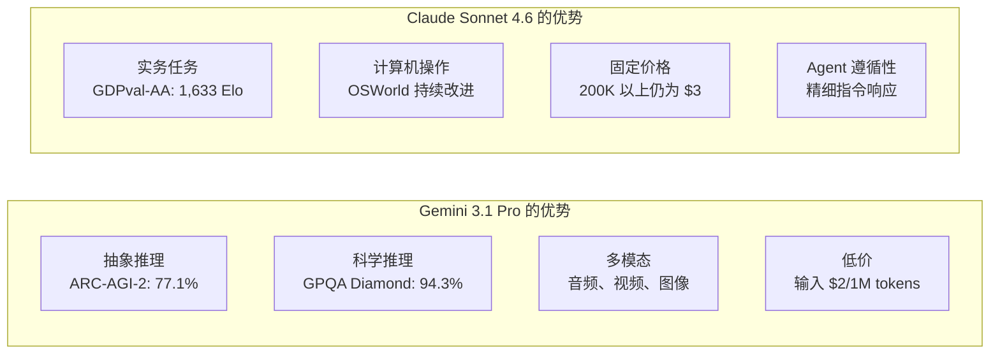

### 标题
Claude Sonnet 4.6 与 Gemini 3.1 Pro — LLM 模型竞赛的最前沿

### 摘要
2026 年 2 月，Claude Sonnet 4.6 和 Gemini 3.1 Pro 几乎同时发布。本文将从 GPQA Diamond 94.3% 等基准测试对比，到实用的部署策略，进行详尽的开发者视角解读。

### 正文

2026 年 2 月的第三周，AI 行业迎来两款备受瞩目的模型。Anthropic 于 2 月 17 日发布了 **Claude Sonnet 4.6**，而 Google DeepMind 于 2 月 19 日公开了 **Gemini 3.1 Pro**。两款模型均以“最先进的 Frontier 模型”自居，并宣布了百万级 token 的上下文窗口支持和通用推理能力的显著增强。

这两款模型的同期发布并非偶然。随着 LLM 的竞争焦点正从“单一任务的最高性能”转向“Agent 应用、长上下文处理、成本效益”，两者都在瞄准同一目标用户群体——企业开发者和 AI Agent 构建者。本文将梳理两款模型的规格、基准测试数据及实际使用特性差异，为开发者提供最优选择指南。

## 发布背景：竞赛脉络

### Anthropic 的战略

Claude Sonnet 4.6 的发布速度惊人，距离同年 2 月 5 日的 Claude Opus 4.6 仅隔 12 天。Anthropic 将成本效益更高的“Sonnet”系列定位为所有用户的默认模型，并向包括免费用户在内的所有层级推广。其战略是：在保持与 Sonnet 4.5 相同的价格（百万 token 输入 $3/输出 $15）的同时，大幅提升性能。

值得关注的是 Claude Code 的评估结果。内部数据显示，开发人员有 70% 的概率会选择 Sonnet 4.6，即使与 Opus 4.6 相比，也有 59% 的情况下选择了 Sonnet。在“性能超越 Opus 的 Sonnet”这一定位下，其性价比优势对于 API 使用成本敏感的生产环境具有强大的吸引力。

同期，Anthropic 还宣布了与 Infosys（印度 IT 巨头）的合作（2 月 17 日）。双方将 Claude 模型整合到 Topaz AI 平台，旨在实现银行、电信、制造业等复杂业务工作流程的自动化，这也是加速企业级部署的信号。

### Google DeepMind 的战略

Google DeepMind 宣布 Gemini 3.1 Pro 在多项基准测试中取得了“史上最高分”。特别是在 ARC-AGI-2（抽象推理基准测试）中，77.1% 的得分比前代 Gemini 3 Pro 提升了近两倍。与同期竞争对手 Claude Opus 4.6 的 68.8% 和 GPT-5.2 的 52.9% 相比，Gemini 在 ARC-AGI-2 上展现了明显的领先优势。

此外，Gemini 在定价上也展开攻势。对于 200K token 以下的常规使用，其输入价格为 $2/输出 $12（百万 token），比 Sonnet 4.6 便宜 33%-35%。“智能 × 成本效益”的双重优势成为其鲜明的立场。

更值得一提的是，1M token 的上下文窗口支持无需等待即可在生产环境中即时使用。与 Sonnet 4.6 的 1M token 仍处于 Beta 阶段且分阶段提供不同，对于需要立即开始大规模代码库或多文件仓库分析的开发者而言，Gemini 具有显著优势。

## 规格对比

整理两款模型的关键规格如下：

| 项目 | Claude Sonnet 4.6 | Gemini 3.1 Pro |
|:-----|:-----------------|:--------------|
| 发布日期 | 2026 年 2 月 17 日 | 2026 年 2 月 19 日 |
| 上下文长度 | 200K（Beta 版支持 1M） | 1M（默认） |
| 输入价格（百万 token） | $3.00 | $2.00（≤200K）/ $4.00（超出） |
| 输出价格（百万 token） | $15.00 | $12.00（≤200K）/ $18.00（超出） |
| 多模态支持 | 文本、图像 | 文本、图像、音频、视频 |
| 最大输出 token | 64K | 64K |
| 提供形式 | API、Claude.ai、Claude Code | API、Gemini.google.com、Vertex AI |

价格方面需注意，Gemini 3.1 Pro 在 200K token 以下价格较低，但超出后会跃升至 $4/$18。Sonnet 4.6 则为固定价格 $3/$15，因此对于大量使用长上下文的工作负载，Sonnet 在成本预测上可能更简单。在批处理成本估算阶段，了解上下文长度的分布至关重要。

## 基准测试详细对比

### 主要基准测试数值

```
基准测试对比（2026 年 2 月公开数据）

ARC-AGI-2（抽象推理）
  Gemini 3.1 Pro  : 77.1%  ← Claude Opus 4.6 (68.8%), GPT-5.2 (52.9%)
  Claude Sonnet 4.6: 58.3%
  差异: +18.8pt (Gemini 优势)

GPQA Diamond（研究生级别科学）
  Gemini 3.1 Pro  : 94.3%  ← 行业最高分
  Claude Sonnet 4.6: 74.1%
  差异: +20.2pt (Gemini 优势)

SWE-Bench Pro（软件工程）
  Gemini 3.1 Pro  : 54.2%
  Claude Sonnet 4.6: 42.7%
  差异: +11.5pt (Gemini 优势)

SWE-Bench Verified（Gemini 官方基准测试）
  Gemini 3.1 Pro  : 80.6%

Terminal-Bench 2.0（终端操作）
  Gemini 3.1 Pro  : 68.5%

GDPval-AA Elo（经济价值任务）
  Claude Sonnet 4.6: 1,633 Elo  ← 甚至超越 Opus 4.6 的水平
  Gemini 3.1 Pro  : 1,317 Elo
  差异: +316pt (Sonnet 优势)

MMMLU（多语言理解）
  Gemini 3.1 Pro  : 92.6%

长上下文精度（128K token 时）
  Gemini 3.1 Pro  : 84.9%
```

从数据上看，纯粹的“推理基准测试”中 Gemini 3.1 Pro 普遍占优。另一方面，GDPval-AA 衡量的是“产生经济价值的实际任务”的 Elo 评分，包括撰写商业文档、财务建模、学术研究等，在此项中 Sonnet 4.6 以 1,633 分展现出压倒性优势。“基准测试王者”与“实际应用王者”的区分，直观地体现了两款模型的特性差异。

### 基准测试解读

**GPQA Diamond（Graduate-Level Google-Proof Q&A）** 包含研究生级别的科学问题，旨在测试解决物理、化学、生物等难题的能力。94.3% 的得分代表着接近“与生物、化学、物理学家同等水平解决问题”的成就。

**ARC-AGI-2** 是 AI 研究者为“衡量不依赖记忆的真正抽象推理能力”而设计的基准测试，考察从少量示例中抽象出全新规则的能力。77.1% 的得分在整个行业中都属突出，远超同期 Claude Opus 4.6 的 68.8% 和 GPT-5.2 的 52.9%。

而 **GDPval-AA** 则侧重于“创造经济价值的实际任务”的综合评估，包含报告撰写、财务分析、项目规划等贴近实际工作的题集。Sonnet 4.6 的 1,633 Elo 甚至超越了 Opus 4.6，证明了 Sonnet 在生成“可用输出”方面的实用性优势。

## 实际应用特性差异

### 编码助手

在编码任务上，虽然 Gemini 在数值上占优，但开发者的主观评价却呈现不同趋势。Sonnet 4.6 在“对细微指令的遵循”和“分步代码审查”方面获得高度评价，在代码审查格式指定和自定义编码规范的遵循上更具优势。

SWE-Bench 系列得分上的差异，主要源于 Agent 自主操作文件进行大规模重构的场景较多。而在人类进行细致指令输入，如结对编程的应用场景下，Sonnet 的遵循性能则成为其强项。

```python
# 使用 Claude Sonnet 4.6 的 Agent 示例
import anthropic

client = anthropic.Anthropic()

# 支持百万 token，可一次性解析大型代码库
with open("large_codebase.txt", "r") as f:
    codebase_content = f.read()

message = client.messages.create(
    model="claude-sonnet-4-6-20260217",
    max_tokens=8192,
    messages=[
        {
            "role": "user",
            "content": (
                "请解析以下代码库，并列出安全漏洞：\n\n"
                + codebase_content
            )
        }
    ]
)
print(message.content[0].text)
```

### 长上下文处理与多模态

Gemini 3.1 Pro 在 128K token 的长上下文基准测试中达到 84.9% 的精度，并且能够处理包含长篇 PDF、音频转录、视频脚本的复合上下文。音频和视频的原生支持是 Sonnet 4.6 目前不具备的差异化优势。

Sonnet 4.6 提供了实用级别的计算机操作（Computer Use）功能，在涉及浏览器或 GUI 应用操作的 Agent 工作流中，与 Anthropic 的生态系统高度兼容。OSWorld 基准测试中也报告了持续的改进，在自动化流程构建方面有稳定的表现。

### 知识密集型任务的压倒性优势

GDPval-AA 的评分差异（316 Elo 分）不容忽视。在“整理知识并转化为实际成果”的任务中，如财务报告摘要、会议纪要生成、多文档交叉分析报告等，Sonnet 4.6 具有明显优势。这反映了 Anthropic 在“深化上下文理解和 Agent 规划”方面的设计理念。

## 架构设计理念差异

从公开信息中，可以解读出两款模型在设计理念上的若干不同之处。

Gemini 3.1 Pro 更倾向于“可扩展的通用推理引擎”。它能够统一处理音频、视频、代码库等所有输入模态，并以 ARC-AGI-2 等纯推理任务为最高目标进行架构设计。Google DeepMind 的模型卡详细描述了基于“frontier safety”框架的安全评估，体现了面向全球规模部署的设计思路。

Claude Sonnet 4.6 则优先考虑“可靠的执行 Agent”的完整性。计算机操作、长上下文推理、Agent 规划等功能的组合，是为适应涉及人类参与的半自主工作流而进行的定向功能选择。Anthropic 与 Infosys 的企业合作，以及其在银行、电信、制造业等复杂业务工作流程自动化方面的实践积累，都与其业务战略高度契合。



## 竞赛揭示的 2026 年 LLM 趋势

Claude Sonnet 4.6 和 Gemini 3.1 Pro 的同期发布，为我们提供了观察 LLM 竞争当前格局的绝佳视角。

**长上下文处理的“标配化”**：两款模型都提供百万 token 上下文（默认或 Beta 版），这已不再是差异化优势，而是基本要求。1M token 意味着可以将项目整个代码库、相关文档、过往 Bug 报告一次性输入。

**面向 Agent 的优化加速**：Agent 工具使用、计算机操作、多步推理，是双方共同聚焦的领域。随着 Agent 的普及，哪款模型能成为 Agent Runtime 的标准，也成为竞争焦点。

**基准测试竞赛的深化**：从单一问题正确率，转向 ARC-AGI-2 这种“无法死记硬背的推理”和 GDPval-AA 这种“衡量经济价值”的指标。“准确回答”正向“可用产出”转变。

**价格竞争持续**：Gemini 的 $2/1M 输入价格，已低于 2023 年 GPT-4 级别的十分之一。竞争加速了模型的民主化，同时也加剧了盈利压力。

## 开发者部署指南

选择哪款模型，取决于“任务性质”、“上下文长度分布”和“与现有技术栈的集成”这三个维度。

| 用例 | 推荐模型 | 原因 |
|:-----------|:---------|:----|
| 科学推理、数学证明 | Gemini 3.1 Pro | GPQA Diamond 94.3% · ARC-AGI-2 77.1% |
| 报告撰写、财务分析 | Claude Sonnet 4.6 | GDPval-AA 1,633 Elo，实务任务最强 |
| 大型代码库解析（即时 1M） | Gemini 3.1 Pro | 1M 支持无需等待即可生产环境使用 |
| 计算机操作 Agent | Claude Sonnet 4.6 | Computer Use · OSWorld 持续改进 |
| 包含音频、视频的多模态 | Gemini 3.1 Pro | 原生支持（Sonnet 4.6 不支持） |
| Google Workspace 集成 | Gemini 3.1 Pro | 原生集成 |
| 大量使用 200K 以上的长 Prompt | Claude Sonnet 4.6 | 超出部分价格稳定（固定 $3） |
| 以 200K 以下的中短 Prompt 为主 | Gemini 3.1 Pro | 输入 $2，节省 33% |

目前无法断言哪款模型“获胜”。这正是当前 LLM 竞争的真实写照。开发者需要结合具体任务需求、成本结构以及与现有技术栈的集成难度，进行具体场景下的评估。

## 参考文献

| 标题 | 信息来源 | 日期 | URL |
|:---------|:-------|:-----|:----|
| Claude Sonnet 4.6 发布公告 | Anthropic | 2026/02/17 | https://www.anthropic.com/news/claude-sonnet-4-6 |
| Gemini 3.1 Pro 发布公告 | Google Blog | 2026/02/19 | https://blog.google/innovation-and-ai/models-and-research/gemini-models/gemini-3-1-pro/ |
| Gemini 3.1 Pro Model Card | Google DeepMind | 2026/02/19 | https://deepmind.google/models/model-cards/gemini-3-1-pro/ |
| Deep Comparison of Gemini 3.1 Pro and Claude Sonnet 4.6 | Apiyi.com Blog | 2026/03 | https://help.apiyi.com/en/gemini-3-1-pro-vs-claude-sonnet-4-6-comparison-en.html |
| Gemini 3.1 Pro vs Sonnet 4.6 vs Opus 4.6 vs GPT-5.2 (2026) | AceCloud AI | 2026/03 | https://acecloud.ai/blog/gemini-3-1-pro-vs-sonnet-4-6-vs-opus-4-6-vs-gpt-5-2/ |
| Gemini 3.1 Pro Complete Guide 2026: Benchmarks, Pricing, API | NxCode | 2026/02 | https://www.nxcode.io/en/resources/news/gemini-3-1-pro-complete-guide-benchmarks-pricing-api-2026 |
| Gemini 3.1 Pro Leads Most Benchmarks But Trails Claude Opus 4.6 in Some Tasks | Trending Topics EU | 2026/02 | https://www.trendingtopics.eu/gemini-3-1-pro-leads-most-benchmarks-but-trails-claude-opus-4-6-in-some-tasks/ |
| Gemini 3.1 Pro vs Claude Sonnet 4.6: 2026 Comparison, Benchmarks | AI.cc | 2026/02 | https://www.ai.cc/blogs/gemini-3-1-pro-vs-claude-sonnet-4-6-2026-comparison-benchmarks/ |
| Infosys × Anthropic 企业级 AI Agent 合作 | TechCrunch | 2026/02/17 | https://techcrunch.com/2026/02/17/as-ai-jitters-rattle-it-stocks-infosys-partners-with-anthropic-to-build-enterprise-grade-ai-agents/ |
| AI 周报 2026 年 2 月第三周 | Synapse AI Digest | 2026/02/21 | https://armes.ai/blog/frontier-model-explosion-february-2026 |

---

> 本文由 LLM 自动生成，内容可能存在错误。
