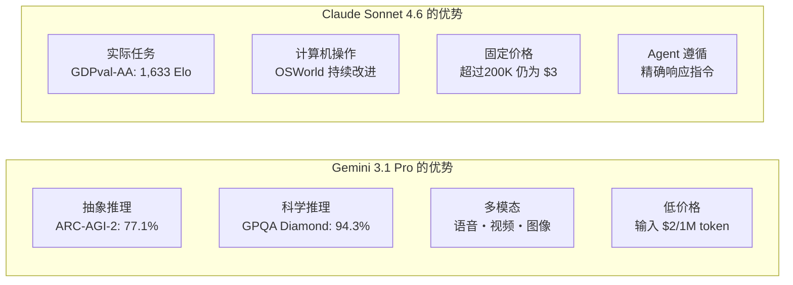

### 标题
Claude Sonnet 4.6 与 Gemini 3.1 Pro — LLM 模型竞争的最前线

### 摘要
2026年2月，Claude Sonnet 4.6 和 Gemini 3.1 Pro 几乎同时发布。本文将从开发者视角，深入解析 GPQA Diamond 94.3% 等基准测试对比，以及实用的选择指南。

### 标签
["Claude","Gemini","LLM","基准测试","AI 比较","Anthropic","Google DeepMind"]

### 正文

2026年2月的第三周，AI 行业迎来了两个备受瞩目的模型。Anthropic 于2月17日发布的 **Claude Sonnet 4.6** 和 Google DeepMind 于2月19日公开的 **Gemini 3.1 Pro**。两者都标榜为“最前沿的模型”，并宣布了对100万 token 上下文窗口的支持和通用推理能力的显著增强。

这两个模型的同期发布并非偶然。随着 LLM 的竞争焦点正从“单一任务最高性能”转向“Agent 应用、长上下文处理、成本效益”，两者都在瞄准同一目标用户群体——企业级开发者和 AI Agent 构建者。本文将整理两款模型的规格、基准测试数据及实际应用特性的差异，为开发者提供最优选择指南。

## 发布背景：竞争的语境

### Anthropic 的战略

Claude Sonnet 4.6 的发布，距离同年的2月5日 Claude Opus 4.6 的发布仅过去12天，其速度令人瞩目。Anthropic 将成本效益更高的“Sonnet”系列定位为所有用户的默认模型，并将其推广至包括免费套餐在内的所有层级。其战略是，在保持与 Sonnet 4.5 相同的输入 $3/输出 $15（每百万 token）价格的同时，大幅提升性能。

值得关注的是 Claude Code 的评估。Anthropic 公布的内部数据显示，开发者有70%的概率偏好 Sonnet 4.6，即使与 Opus 4.6 相比，也有59%的情况下选择了 Sonnet。在性价比方面，“超越 Opus 的 Sonnet”的定位，对于那些对 API 使用成本敏感的生产环境具有有效的吸引力。

同期，Anthropic 还宣布了与 Infosys（印度IT巨头）的合作（2月17日）。双方将 Claude 模型集成到 Topaz AI 平台，旨在实现银行、通信、制造业等复杂业务工作流的自动化，这也是加速企业级部署的信号。

### Google DeepMind 的战略

Google DeepMind 宣布 Gemini 3.1 Pro 在多个基准测试中取得了“史上最高分”。特别是 ARC-AGI-2（抽象推理基准测试）的77.1%，相比前代 Gemini 3 Pro 提升了近一倍。与同期竞争对手 Claude Opus 4.6 的68.8% 和 GPT-5.2 的52.9% 相比，在 ARC-AGI-2 上 Gemini 展现了明显的领先优势。

此外，Gemini 在价格上也进行了攻势。对于200K token 以下的常规使用，输入价格为 $2/输出 $12（每百万 token），比 Sonnet 4.6 低33%至35%。在“智能 × 成本效益”两个方面都主张优势的姿态十分鲜明。

更重要的是，1M token 的上下文窗口在无需申请的情况下即可在生产环境中使用，这也是一项差异化优势。与 Sonnet 4.6 的1M token 仍处于 Beta 版并分阶段提供不同，对于希望立即开始处理大规模代码库或多文件仓库分析的开发者来说，Gemini 具有优势。

## 规格对比

整理两款模型的基本规格。

| 项目 | Claude Sonnet 4.6 | Gemini 3.1 Pro |
|:-----|:-----------------|:--------------|
| 发布日期 | 2026年2月17日 | 2026年2月19日 |
| 上下文长度 | 200K（Beta 版支持1M） | 1M（默认） |
| 输入价格（每百万 token） | $3.00 | $2.00（≤200K）/ $4.00（超过） |
| 输出价格（每百万 token） | $15.00 | $12.00（≤200K）/ $18.00（超过） |
| 多模态支持 | 文本・图像 | 文本・图像・语音・视频 |
| 最大输出 token | 64K | 64K |
| 提供形式 | API・Claude.ai・Claude Code | API・Gemini.google.com・Vertex AI |

关于价格的注意事项：Gemini 3.1 Pro 在200K token 以下价格较低，但超过此阈值后会飙升至 $4/$18。Sonnet 4.6 价格统一为 $3/$15，无波动，因此对于频繁使用长上下文的工作负载，Sonnet 可能更容易预测成本。在进行批量处理的成本估算时，了解上下文长度的分布至关重要。

## 基准测试详细对比

### 主要基准测试数据

```
基准测试对比（2026年2月公开数据）

ARC-AGI-2（抽象推理）
  Gemini 3.1 Pro  : 77.1%  ← Claude Opus 4.6 (68.8%), GPT-5.2 (52.9%)
  Claude Sonnet 4.6: 58.3%
  差值: +18.8pt (Gemini 优势)

GPQA Diamond（研究生水平科学）
  Gemini 3.1 Pro  : 94.3%  ← 行业最高分
  Claude Sonnet 4.6: 74.1%
  差值: +20.2pt (Gemini 优势)

SWE-Bench Pro（软件工程）
  Gemini 3.1 Pro  : 54.2%
  Claude Sonnet 4.6: 42.7%
  差值: +11.5pt (Gemini 优势)

SWE-Bench Verified（Gemini 官方基准测试）
  Gemini 3.1 Pro  : 80.6%

Terminal-Bench 2.0（终端操作）
  Gemini 3.1 Pro  : 68.5%

GDPval-AA Elo（经济价值任务）
  Claude Sonnet 4.6: 1,633 Elo  ← 甚至超越 Opus 4.6 的水平
  Gemini 3.1 Pro  : 1,317 Elo
  差值: +316pt (Sonnet 优势)

MMMLU（多语言理解）
  Gemini 3.1 Pro  : 92.6%

长上下文精度（128K token 时）
  Gemini 3.1 Pro  : 84.9%
```

从数据上看，纯粹的“推理基准测试”中 Gemini 3.1 Pro 普遍领先。另一方面，GDPval-AA 衡量的是“产生经济价值的实际任务”的 Elo 评分，涵盖报告撰写、财务建模、学术研究等，在此领域 Sonnet 4.6 以1,633 Elo 的绝对优势领先。“基准测试王者”和“实际任务王者”的不同，恰恰说明了两款模型特性上的差异。

### 基准测试的解读

**GPQA Diamond（Graduate-Level Google-Proof Q&A）** 是研究生水平的理科问题集，用于衡量解决物理、化学、生物难题的能力。94.3% 的分数是行业最高水平，接近于“能以生物学家、化学家、物理学家同等水平解决问题”。

**ARC-AGI-2** 是由 AI 研究者设计的，旨在“衡量无法通过记忆解决的真正抽象推理能力”的基准测试。它考察的是从少量样本中抽象出全新规则的能力。在此项测试中，77.1% 是整个行业中非常突出的水平，远超同期的 Claude Opus 4.6 的68.8% 和 GPT-5.2 的52.9%。

然而，**GDPval-AA** 是“产生经济价值的实际任务”的综合评估，包含报告撰写、财务分析、项目规划等贴近实际业务的问题。Sonnet 4.6 的1,633 Elo 水平甚至超越了 Opus 4.6，这表明 Sonnet 在生成“可用输出”的实用性方面表现突出。

## 实际应用特性差异

### 编码辅助

在编码任务上，虽然 Gemini 在数据上占优，但开发者主观评价却呈现不同趋势。Sonnet 4.6 在“遵循细微指令”和“分步代码审查”方面获得高度评价，在指定代码审查格式或符合自定义编码规范方面具有优势。

SWE-Bench 系列得分的差距，在于其多包含 Agent 自主操作文件、进行大规模重构的场景。而在人类进行细致指令输入的结对编程场景下，Sonnet 的遵循能力则成为其优势。

```python
# 使用 Claude Sonnet 4.6 的 Agent 示例
import anthropic

client = anthropic.Anthropic()

# 支持100万 token，可一次性解析大型代码库
with open("large_codebase.txt", "r") as f:
    codebase_content = f.read()

message = client.messages.create(
    model="claude-sonnet-4-6-20260217",
    max_tokens=8192,
    messages=[
        {
            "role": "user",
            "content": (
                "请分析以下代码库，并列出安全漏洞:\n\n"
                + codebase_content
            )
        }
    ]
)
print(message.content[0].text)
```

### 长上下文处理与多模态

Gemini 3.1 Pro 在128K token 的长上下文基准测试中取得了84.9%的准确率，能够处理包含长篇 PDF、语音转录、视频字幕等复合上下文。语音和视频的原生支持是 Sonnet 4.6 目前不具备的差异化优势。

Sonnet 4.6 提供了实用的计算机操作（Computer Use）功能，在涉及浏览器或 GUI 应用程序操作的 Agent 工作流中，与 Anthropic 的生态系统有更高的兼容性。OSWorld 基准测试也报告了持续改进，在自动化流程构建方面具有稳定的实绩。

### 知识工作中的显著差异

GDPval-AA 的数值差异（316 Elo 点）不容忽视。在“整理知识并转化为实际成果”的任务中，如财务报告摘要、会议纪要生成、跨多文档的分析报告生成，Sonnet 4.6 具有明显优势。这可以看作是 Anthropic “强化上下文理解深度和 Agent 规划能力”的设计方针的体现。

## 架构设计理念的差异

从公开信息中解读两款模型的设计理念差异，可以发现一些对比点。

Gemini 3.1 Pro 具有“可扩展的通用推理引擎”的强烈特性。它能够统一处理语音、视频、代码库等所有输入模态，其架构方向似乎旨在实现 ARC-AGI-2 型的纯粹推理任务的最高性能。Google DeepMind 的模型卡详细描述了基于“frontier safety”框架的安全评估，体现了面向全球规模部署的设计理念。

Claude Sonnet 4.6 则优先考虑“可靠的执行 Agent”的完成度。计算机操作、长上下文推理、Agent 规划的组合，是为适应人类参与的半自主工作流而选择的功能。Anthropic 与 Infosys 的企业合作，以及在银行、通信、制造业复杂业务工作流自动化方面的实绩积累，与其商业战略相呼应。



## 竞争揭示的2026年 LLM 趋势

Claude Sonnet 4.6 和 Gemini 3.1 Pro 的同期发布，是观察 LLM 竞争现状的一个良好切入点。

**长上下文处理的“前提化”**：两款模型均提供100万 token 上下文（默认或 Beta 版），这已不再是差异化要素，而是趋于成为基础配置。1M token 允许一次性输入整个项目的代码库、相关文档和历史 Bug 报告。

**面向 Agent 的优化加速**：Agent 工具使用、计算机操作、多步推理——这些是双方共同发力的领域。随着 MCP 的普及，哪款模型将成为 Agent 运行时（runtime）的标准，也成为竞争焦点。

**基准测试竞争的深化**：竞争正从单一问题的正确率，转向衡量 ARC-AGI-2 这种“无法记忆的推理”或 GDPval-AA 这种“经济价值”的指标。“精确回答”正向“可用成果”转变。

**价格竞争的持续**：Gemini 的 $2/1M 输入价格，远低于2023年的 GPT-4 级别价格。竞争在加速模型普及的同时，也加剧了盈利压力。

## 开发者使用指南

选择哪款模型，取决于“任务性质”、“上下文长度分布”、“与现有栈的集成”这三个维度。

| 用例 | 推荐模型 | 理由 |
|:-----------|:---------|:----|
| 科学推理・数学证明 | Gemini 3.1 Pro | GPQA Diamond 94.3%・ARC-AGI-2 77.1% |
| 报告撰写・财务分析 | Claude Sonnet 4.6 | GDPval-AA 1,633 Elo，实际任务最强 |
| 大规模代码库分析（即时1M） | Gemini 3.1 Pro | 1M token 无需等待即可生产使用 |
| 计算机操作 Agent | Claude Sonnet 4.6 | Computer Use 功能，OSWorld 持续改进 |
| 包含语音・视频的多模态 | Gemini 3.1 Pro | 原生支持（Sonnet 不支持） |
| Google Workspace 集成 | Gemini 3.1 Pro | 原生集成 |
| 频繁使用超过200K 的长 Prompt | Claude Sonnet 4.6 | 超过200K 后价格不变（统一 $3） |
| 以200K 以下的短 Prompt 为主 | Gemini 3.1 Pro | 输入 $2，便宜33% |

哪款模型“获胜”无法一概而论，这是当前 LLM 竞争的真实写照。开发者需要根据具体任务需求、成本结构以及与现有栈的集成难度，进行逐一评估。

## 参考文献

| 标题 | 信息源 | 日期 | URL |
|:---------|:-------|:-----|:----|
| Claude Sonnet 4.6 发布公告 | Anthropic | 2026/02/17 | https://www.anthropic.com/news/claude-sonnet-4-6 |
| Gemini 3.1 Pro 发布公告 | Google Blog | 2026/02/19 | https://blog.google/innovation-and-ai/models-and-research/gemini-models/gemini-3-1-pro/ |
| Gemini 3.1 Pro Model Card | Google DeepMind | 2026/02/19 | https://deepmind.google/models/model-cards/gemini-3-1-pro/ |
| Deep Comparison of Gemini 3.1 Pro and Claude Sonnet 4.6 | Apiyi.com Blog | 2026/03 | https://help.apiyi.com/en/gemini-3-1-pro-vs-claude-sonnet-4-6-comparison-en.html |
| Gemini 3.1 Pro vs Sonnet 4.6 vs Opus 4.6 vs GPT-5.2 (2026) | AceCloud AI | 2026/03 | https://acecloud.ai/blog/gemini-3-1-pro-vs-sonnet-4-6-vs-opus-4-6-vs-gpt-5-2/ |
| Gemini 3.1 Pro Complete Guide 2026: Benchmarks, Pricing, API | NxCode | 2026/02 | https://www.nxcode.io/en/resources/news/gemini-3-1-pro-complete-guide-benchmarks-pricing-api-2026 |
| Gemini 3.1 Pro Leads Most Benchmarks But Trails Claude Opus 4.6 in Some Tasks | Trending Topics EU | 2026/02 | https://www.trendingtopics.eu/gemini-3-1-pro-leads-most-benchmarks-but-trails-claude-opus-4-6-in-some-tasks/ |
| Gemini 3.1 Pro vs Claude Sonnet 4.6: 2026 Comparison, Benchmarks | AI.cc | 2026/02 | https://www.ai.cc/blogs/gemini-3-1-pro-vs-claude-sonnet-4-6-2026-comparison-benchmarks/ |
| Infosys × Anthropic Enterprise AI Agent Partnership | TechCrunch | 2026/02/17 | https://techcrunch.com/2026/02/17/as-ai-jitters-rattle-it-stocks-infosys-partners-with-anthropic-to-build-enterprise-grade-ai-agents/ |
| AI Weekly Digest February Week 3, 2026 | Synapse AI Digest | 2026/02/21 | https://armes.ai/blog/frontier-model-explosion-february-2026 |

---

> 本文由 LLM 自动生成，内容可能存在错误。
