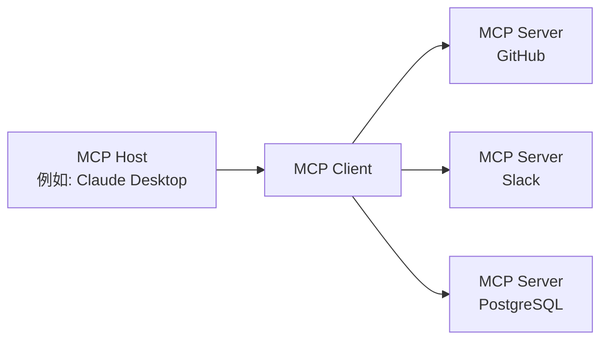

## 前言

2024 年 11 月，Anthropic 发布了 **Model Context Protocol（MCP）**，这是一种用于连接 AI Agent 与外部工具和数据源的新型开放标准，在短短一年多的时间里取得了爆炸性的普及。月下载量超过 9700 万次 SDK，以及超过 10000 个公开的 MCP 服务器，这不仅仅是一个技术规范，更预示着其正逐步确立 AI Agent 时代基础架构的地位。

本文将全面解析 MCP 的技术机制、OpenAI、Google、Microsoft 采用它的过程，以及其向 Linux Foundation 捐赠这一关键转折点，并探讨当前仍存在的安全挑战。

--- 

## MCP 解决的“N×M 问题”

### AI 系统的“信息孤岛”问题

在 MCP 出现之前，AI 应用与外部数据源的集成效率低下。例如，若想将 Claude 与 Slack、GitHub、Google Drive、Postgres 数据库分别集成，就需要为每个数据源实现独立的连接器。

Anthropic 将这种情况称为“**N×M 问题**”。其中 N 是数据源的数量，M 是利用这些数据源的 AI 应用数量，理论上需要 N×M 个独立的实现。仅仅是为 5 个 AI 应用使用 10 种工具，就需要 50 个自定义实现。

```
【无 MCP】
Claude  ─── 独立实现 A ──→ GitHub
Claude  ─── 独立实现 B ──→ Slack
GPT-4   ─── 独立实现 C ──→ GitHub  （与 A 几乎相同）
GPT-4   ─── 独立实现 D ──→ Slack   （与 B 几乎相同）

【有 MCP】
Claude ─┐
GPT-4  ─┤── MCP Client ──→ MCP Server（GitHub）
Gemini ─┘                ──→ MCP Server（Slack）
```

MCP 以“1:N”的结构解决了这个问题。一旦实现为 MCP Server，所有支持 MCP 的 AI Client 都可以使用它。

--- 

## MCP 的技术架构

### 三层组成部分

MCP 采用客户端-服务器架构，由三个角色组成。

| 角色       | 描述                                             |
|:-----------|:-------------------------------------------------|
| **MCP Host** | AI 应用主体。负责管理和协调一个或多个 MCP Client |
| **MCP Client** | 维护与 MCP Server 的连接，获取上下文并提供给 Host |
| **MCP Server** | 提供对外部工具或数据源的访问接口                 |



### 协议基础：JSON-RPC 2.0

MCP 的消息传递层基于 JSON-RPC 2.0。消息类型分为三种：

- **Request**: 需要响应的请求
- **Response**: 请求的响应
- **Notification**: 单向通知，无需响应

### 传输层

MCP 支持两种主要的传输方式：

**stdio（标准输入输出）**

最适合与本地资源集成。通过简单的输入输出流进行通信。常用于本地 AI 应用（如 Claude Desktop）与本地 MCP Server 之间的连接。

**Streamable HTTP（原称：SSE）**

通过 HTTP 上的 Server-Sent Events（SSE）实现从服务器到客户端的流式消息传输。适用于长时间运行的任务或增量更新。在 2025 年的规范更新（2025-11-25 版）中，传输名称从“SSE”改为“Streamable HTTP”，实现了更灵活的双向通信。

### 三种原语（Primitives）

MCP Server 向外部公开的功能通过以下三种原语定义。

**Resources（资源）**

提供对数据源的读取访问。以 AI 可引用的形式提供文件系统、数据库、API 响应等。

**Tools（工具）**

允许执行任意代码。AI 用于创建文件、调用 API、修改外部系统等。工具执行可能伴随副作用，因此需要适当的权限管理。

**Prompts（提示）**

提供预定义的提示模板。AI 可以接收结构化的输入，而不是“在 GitHub 上创建一个 Bug 报告 issue”这样的模糊指令。

--- 

## 爆炸式增长：发布一年后

### 数据体现生态系统增长

MCP 于 2024 年 11 月发布时，公开的 MCP Server 数量仅约 100 个。但其增长速度令人瞩目。

| 时间点             | 公开服务器数量 | 月 SDK 下载量 | 
|:-------------------|:---------------|:---------------|
| 2024 年 11 月（发布时） | 约 100 个       | —              |
| 2025 年 5 月        | 超过 4000 个    | —              |
| 2025 年 12 月       | 超过 10000 个   | 9700 万次      |

Anthropic 在发布 MCP 的同时，还提供了 GitHub、Slack、Google Drive、Git、PostgreSQL、Puppeteer 等主流企业系统参考 MCP Server。这极大地降低了开发者的准入门槛，促成了生态系统的快速扩张。

### 主要 AI 厂商的采用

MCP 在短时间内确立了行业标准地位。

**OpenAI（2025 年 3 月）**

OpenAI 在 ChatGPT 及 API 中宣布正式支持 MCP。尽管 OpenAI 长期拥有自家的 Function Calling 功能，但通过采用 MCP 这一开放标准，成功融入了庞大的 MCP 生态系统。

**Google（2025 年 4 月）**

MCP 已集成到 Gemini 模型中。通过 Google AI Studio 和 Vertex AI，可以访问 MCP Server，使 Google 的企业客户能够通过 Gemini 连接现有的内部系统。

**Microsoft（2025 年）**

在 Copilot Studio 和 Azure OpenAI Service 中增加了 MCP 支持。Visual Studio Code 也集成了 MCP Client 功能，加速了开发工作流与 AI 的集成。

--- 

## 捐赠给 Linux Foundation 及 Agentic AI Foundation 成立

### 关键转折点

2025 年 12 月，Anthropic 做出了一项重要决定：将 MCP 捐赠给 Linux Foundation 下属新设立的基金会“**Agentic AI Foundation（AAIF）**”。

此举并非仅仅是治理结构的变更。Anthropic 选择将 MCP 定位为 AI Agent 时代的开放基础设施，而非“自有产品的差异化竞争要素”。

### Agentic AI Foundation（AAIF）概述

AAIF 作为 Linux Foundation 下属的 Directed Fund 成立。

**联合创始成员**
- Anthropic（捐赠 MCP）
- Block（捐赠 goose）
- OpenAI（捐赠 AGENTS.md）

**白金会员（参与治理）**
Amazon Web Services、Anthropic、Block、Bloomberg、Cloudflare、Google、Microsoft、OpenAI

**创始项目**
- Model Context Protocol（MCP）— Anthropic 提供
- goose — Block 提供的 AI Agent 框架
- AGENTS.md — OpenAI 提供的 Agent 规范描述标准

在 Linux Foundation 的框架下，MCP 的治理转变为由社区主导、不受供应商影响的模式。这与 Kubernetes（容器编排）和 NodeJS 等在 Linux Foundation 下确立行业标准的模式类似。

--- 

## MCP 与 REST API 的比较

### 设计理念差异

MCP 与 REST API 并非竞争关系，而是互补关系。理解它们的设计理念差异至关重要。

| 视角       | REST API           | MCP                    |
|:-----------|:-------------------|:-----------------------|
| 预期客户端 | 传统软件           | LLM / AI Agent         |
| 会话       | 无状态（Stateless）| 有状态（Stateful）       |
| 发现机制   | 通过 OpenAPI 等单独描述 | 服务器动态公开         |
| 多步骤操作 | 每个请求都需要认证 | 通过维持会话提高效率     |
| 流式传输   | 需要 WebSocket 等 | 通过 SSE/Streamable HTTP 原生支持 |

### MCP 适用于 AI Agent 的原因

当 AI Agent 需要连续调用多个工具时，MCP 设计的优势就显而易见了。

```
【AI Agent 的代码审查任务】
1. 从 GitHub 获取 PR 差分 → MCP Tools
2. 读取相关代码文件 → MCP Resources
3. 获取安全检查的提示 → MCP Prompts
4. 将代码审查评论发布到 GitHub → MCP Tools
```

使用 REST API，每一步都需要附加认证头、重新发送上下文。而 MCP 维持会话状态，可以最大限度地降低认证成本，高效执行多阶段任务。

此外，AI Agent 可能不知道哪些工具可用。MCP Server 动态公开其提供的 Tools、Resources、Prompts，使得 Agent 可以在运行时进行发现，并选择合适的工具。

--- 

## 安全挑战

### MCP 的安全风险

尽管 MCP 以每月 9700 万的下载量迅速普及，但安全研究人员对 MCP 的快速推广也表示担忧。主要的潜在安全风险包括：

**Token 泄露风险**
MCP 采用 OAuth 2.1 作为授权框架，但如果客户端或服务器端的缓存/日志中记录了访问 Token，攻击者可能将其作为合法请求进行滥用，从而访问受保护的资源。

**Confused Deputy 攻击**
当 MCP Server 作为 OAuth 代理运行时，如果授权上下文验证不当，攻击者可能利用其他用户的身份信息，诱导服务器执行恶意操作。

**动态客户端注册的管理**
通过 OAuth 的动态客户端注册，MCP Client 可以动态地向服务器添加 OAuth 客户端配置。然而，对于添加客户端配置的管理和删除，RFC 的支持并不普遍，仍然存在未解决的管理难题。

### 2025 年 6 月规范更新中的应对措施

MCP 规范的 2025 年 6 月更新将安全强化作为主要议题之一。

- **强制要求 PKCE（Proof Key for Code Exchange）**: 按照 OAuth 2.1 Section 7.5.2 实现 PKCE，以防止授权码被截获或注入的攻击。
- **引入 Resource Indicators（RFC 8707）**: 为确保 Token 只在预期的 MCP Server 上有效，Token 请求中必须包含资源指示符。这可以防止 Token 的“目的外重用”。
- **禁止 Token Passthrough**: MCP Server 不得接受为非自身明确发行的 Token。

--- 

## 当前生态系统与未来展望

### 主要 MCP Server 示例

截至 2026 年，MCP Server 已广泛应用于以下类别：

**开发工具**
- GitHub MCP Server（PR 管理、代码审查）
- Git MCP Server（本地仓库操作）
- VS Code 集成 MCP Server 系列

**数据与基础设施**
- PostgreSQL MCP Server
- SQLite MCP Server
- Cloudflare Workers MCP Server

**通信与生产力**
- Slack MCP Server
- Google Drive MCP Server
- Notion MCP Server

**AI 与研究**
- Brave Search MCP Server
- Puppeteer MCP Server（网页抓取）
- Fetch MCP Server

### 自主 Agent 时代的基石

MCP 的本质在于解决 AI Agent 如何“用好工具”的问题。AI Agent 将从独立运行阶段过渡到多 Agent 协同工作、共享工具的阶段，MCP 的重要性也将日益凸显。

AAIF 的成立标志着 MCP 从 Anthropic 的产品，演变为行业通用的基础设施。正如 Kubernetes 和 NodeJS 在 Linux Foundation 下成为行业标准，MCP 是否能成为 AI Agent 时代的“TCP/IP”，将在未来 2-3 年内揭晓。

--- 

## 总结

MCP 在以下三个方面标志着重要的技术转变：

**1. 解决 N×M 问题**
通过标准化 AI 系统与外部工具的连接，极大地降低了开发成本。

**2. 形成行业共识**
尽管是 Anthropic 发起的协议，但 OpenAI、Google、Microsoft 作为 AAIF 白金会员的参与，成功促成了包含竞争对手在内的行业标准的形成。

**3. 治理中立化**
捐赠给 Linux Foundation，消除了对特定供应商的依赖，确立了开放的治理体系。

随着 AI Agent 在 2026 年后逐步渗透到实际工作中，MCP 将继续作为其基础设施发挥作用。对于开发者而言，理解 MCP 的机制并有效利用 MCP Server，已成为构建 AI 集成系统的起点。

--- 

## 参考文献

| 标题                                                                 | 信息源             | 日期       | URL                                                                                              | 
|:---------------------------------------------------------------------|:-------------------|:-----------|:-------------------------------------------------------------------------------------------------|
| Introducing the Model Context Protocol                               | Anthropic          | 2024-11-25 | https://www.anthropic.com/news/model-context-protocol                                            | 
| Donating the Model Context Protocol and establishing the Agentic AI Foundation | Anthropic          | 2025-12-09 | https://www.anthropic.com/news/donating-the-model-context-protocol-and-establishing-of-the-agentic-ai-foundation | 
| MCP joins the Agentic AI Foundation                                    | MCP Blog           | 2025-12-09 | http://blog.modelcontextprotocol.io/posts/2025-12-09-mcp-joins-agentic-ai-foundation/                  | 
| Linux Foundation Announces the Formation of the Agentic AI Foundation (AAIF) | Linux Foundation   | 2025-12-09 | https://www.linuxfoundation.org/press/linux-foundation-announces-the-formation-of-the-agentic-ai-foundation | 
| Model Context Protocol Specification 2025-11-25                        | modelcontextprotocol.io | 2025-11-25 | https://modelcontextprotocol.io/specification/2025-11-25                                             | 
| MCP joins the Linux Foundation: What this means for developers         | GitHub Blog        | 2025-12-09 | https://github.blog/open-source/maintainers/mcp-joins-the-linux-foundation-what-this-means-for-developers-building-the-next-era-of-ai-tools-and-agents/ | 
| Model Context Protocol (MCP): Understanding security risks and controls | Red Hat            | 2025       | https://www.redhat.com/en/blog/model-context-protocol-mcp-understanding-security-risks-and-controls | 
| MCP Specs Update — All About Auth                                    | Auth0              | 2025-06    | https://auth0.com/blog/mcp-specs-update-all-about-auth/                                              | 
| Why the Model Context Protocol Won                                     | The New Stack      | 2025       | https://thenewstack.io/why-the-model-context-protocol-won/                                           | 
| A Year of MCP: From Internal Experiment to Industry Standard           | Pento              | 2025-12    | https://www.pento.ai/blog/a-year-of-mcp-2025-review                                                  | 
| Model Context Protocol - Wikipedia                                     | Wikipedia          | 2026       | https://en.wikipedia.org/wiki/Model_Context_Protocol                                                 |

---

> 本文由 LLM 自动生成，内容可能存在错误。
