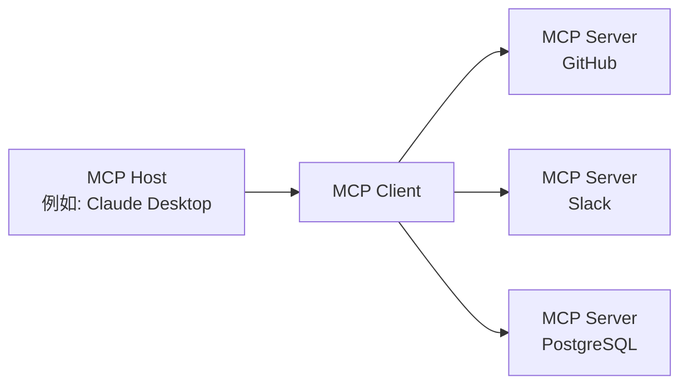

## 前言

2024 年 11 月，Anthropic 发布了 **Model Context Protocol（MCP）**，作为连接 AI Agent 与外部工具/数据源的新型开放标准，在短短一年多时间内实现了惊人的普及。月均 SDK 下载量超过 9700 万次，公开 MCP 服务器超过 1 万个，这些数据表明 MCP 已超越了单纯的技术规范范畴，正逐步确立其作为 AI Agent 时代基础架构的地位。

本文将全面解析 MCP 的技术机制、OpenAI、Google、Microsoft 的采用历程，以及其捐赠给 Linux Foundation 这一重要转折点，并深入探讨目前仍在讨论中的安全挑战。

---

## MCP 解决的“N×M 问题”

### AI 系统的“信息孤岛”问题

在 MCP 出现之前，AI 应用与外部数据源的集成效率低下且问题重重。例如，若要将 Claude 与 Slack、GitHub、Google Drive、Postgres 数据库分别集成，就需要为每个数据源实现独立的连接器。

Anthropic 将此状况称为“**N×M 问题**”。若 N 代表数据源的数量，M 代表使用这些数据源的 AI 应用数量，则理论上需要实现 N×M 个独立的接口。仅用 5 个 AI 应用连接 10 种工具，就意味着需要 50 个定制化实现。

```
【无 MCP】
Claude  ─── 自定义实现 A ──→ GitHub
Claude  ─── 自定义实现 B ──→ Slack
GPT-4   ─── 自定义实现 C ──→ GitHub  （与 A 类似）
GPT-4   ─── 自定义实现 D ──→ Slack   （与 B 类似）

【有 MCP】
Claude ─┐
GPT-4  ─┤── MCP Client ──→ MCP Server（GitHub）
Gemini ─┘                ──→ MCP Server（Slack）
```

MCP 通过“**1:N**”的结构解决了这个问题。一旦实现为 MCP Server，所有支持 MCP 的 AI Client 均可访问。

---

## MCP 的技术架构

### 三层组成要素

MCP 采用客户端-服务器架构，由三个角色构成。

| 角色        | 说明                                       |
| :---------- | :----------------------------------------- |
| **MCP Host** | AI 应用主体。管理和协调一个或多个 MCP Client |
| **MCP Client** | 维持与 MCP Server 的连接，获取上下文并提供给 Host |
| **MCP Server** | 提供对外部工具和数据源的访问的程序         |



### 协议基础：JSON-RPC 2.0

MCP 的消息传递层基于 JSON-RPC 2.0。消息类型分为三种：

- **Request**：需要响应的回执请求
- **Response**：请求的响应
- **Notification**：无需响应的单向通知

### 传输层

MCP 支持两种主要的传输方式。

**stdio（标准输入/输出）**

最适合与本地资源集成。通过简单的输入输出流进行通信。Claude Desktop 等本地 AI 应用与本地 MCP Server 的连接广泛采用此方式。

**Streamable HTTP（原称：SSE）**

通过 HTTP 上的 Server-Sent Events（SSE）实现服务器到客户端的流式消息传输。适用于长时间运行的任务和增量更新。在 2025 年的规范更新（2025-11-25 版）中，传输名称从“SSE”改为“Streamable HTTP”，实现了更灵活的双向通信。

### 三种原始操作（Primitives）

MCP Server 向外部公开的功能通过三种原始操作定义。

**Resources（资源）**

提供对数据源的读取访问。以 AI 可引用的形式提供文件系统、数据库、API 响应等。

**Tools（工具）**

允许执行任意代码。AI 在创建文件、调用 API、修改外部系统时使用。工具执行可能产生副作用，因此需要适当的权限管理。

**Prompts（提示）**

提供预定义的提示模板。能够将结构化的必要字段传达给 AI，而非“在 GitHub 上创建一个 bug 报告 issue”这类模糊的指令。

---

## 爆炸式增长：发布一年后

### 数据化的生态系统增长

MCP 于 2024 年 11 月发布时，公开 MCP Server 数量仅约 100 个。但其增长速度令人惊叹。

| 时期                 | 公开服务器数 | 月均 SDK 下载量 | 
| :------------------- | :----------- | :-------------- |
| 2024 年 11 月（发布时） | 约 100 个    | —               |
| 2025 年 5 月         | 超过 4000 个 | —               |
| 2025 年 12 月        | 超过 10000 个| 9700 万次       |

Anthropic 在发布 MCP 的同时，提供了 GitHub、Slack、Google Drive、Git、PostgreSQL、Puppeteer 等主流企业系统的参考 MCP Server。这极大地降低了开发者的入门门槛，促成了生态系统的快速扩张。

### 主要 AI 企业的采纳

MCP 在短时间内确立了行业标准地位。

**OpenAI（2025 年 3 月）**

OpenAI 在 ChatGPT 和 API 中宣布正式支持 MCP。该公司虽然长期拥有自己的 Function Calling 功能，但通过采纳 MCP 这一开放标准，整合了庞大的 MCP 生态系统。

**Google（2025 年 4 月）**

MCP 已集成到 Gemini 模型中。通过 Google AI Studio 和 Vertex AI，可以访问 MCP Server，Google 的企业客户得以通过 Gemini 连接现有的内部系统。

**Microsoft（2025 年）**

在 Copilot Studio 和 Azure OpenAI Service 中增加了 MCP 支持。MCP Client 功能也被集成到 Visual Studio Code 中，加速了开发工作流与 AI 的融合。

---

## 捐赠给 Linux Foundation 及 Agentic AI Foundation 成立

### 重要转折点

2025 年 12 月，Anthropic 做出了一项极其重要的决定：将 MCP 捐赠给 Linux Foundation 下属新设立的基金会“**Agentic AI Foundation（AAIF）**”。

这一决定不仅仅是治理模式的变更。Anthropic 选择将 MCP 定位为 AI Agent 时代的基础设施，而非“自身产品的差异化要素”。

### Agentic AI Foundation（AAIF）概览

AAIF 作为 Linux Foundation 下属的 Directed Fund 成立。

**联合创始人**
- Anthropic（捐赠 MCP）
- Block（捐赠 goose）
- OpenAI（捐赠 AGENTS.md）

**白金会员（参与治理）**
Amazon Web Services、Anthropic、Block、Bloomberg、Cloudflare、Google、Microsoft、OpenAI

**创始项目**
- Model Context Protocol（MCP）— Anthropic 提供
- goose — Block 提供的 AI Agent 框架
- AGENTS.md — OpenAI 提供的 Agent 规范描述标准

在 Linux Foundation 的领导下，MCP 的治理转变为由社区主导、厂商中立的模式。这与 Kubernetes（容器编排）和 NodeJS 等在 Linux Foundation 旗下成为行业标准的模式类似。

---

## MCP 与 REST API 对比

### 设计理念差异

MCP 与 REST API 并非竞争关系，而是互补关系。理解它们的设计理念差异至关重要。

| 观点       | REST API                | MCP                                   |
| :--------- | :---------------------- | :------------------------------------ |
| 目标客户端 | 传统软件                | LLM/AI Agent                          |
| 会话       | 无状态                  | 有状态                                |
| 发现       | 需要 OpenAPI 等单独描述 | Server 动态公开                        |
| 多步操作   | 每请求一次认证          | 维持会话，提高效率                    |
| 流式传输   | 需要 WebSocket 等额外支持 | 通过 SSE/Streamable HTTP 原生支持 |

### AI Agent 适用 MCP 的原因

当 AI Agent 需要连续调用多个工具时，MCP 设计的优势便显而易见。

```
【AI Agent 的代码审查任务】
1. 从 GitHub 获取 PR 差分 → MCP Tools
2. 读取相关代码文件 → MCP Resources
3. 获取安全检查的 Prompt → MCP Prompts
4. 将代码审查评论发布到 GitHub → MCP Tools
```

使用 REST API 时，每个步骤都需要附加认证头、重传上下文。而 MCP 维持会话状态，可最大限度地降低认证成本，高效执行多步任务。

此外，AI Agent 可能不知道哪些工具可用。MCP Server 动态公开其提供的 Tools、Resources、Prompts，使 Agent 能够执行时发现并选择合适的工具。

---

## 安全挑战

### MCP 的安全风险

面对月均 9700 万的下载量，安全研究者也对 MCP 的快速普及表达了担忧。主要安全风险如下：

**Token 泄露风险**

MCP 采用 OAuth 2.1 作为授权框架，但若 Client 或 Server 端在缓存/日志中记录了访问 Token 泄露，攻击者便能以合法请求的身份访问受保护资源。

**Confused Deputy 攻击**

MCP Server 作为 OAuth 代理运行时，若授权上下文验证不当，攻击者可能利用其他用户的凭证使 Server 执行恶意操作。

**动态 Client 注册管理**

OAuth 的动态 Client 注册允许 MCP Client 动态添加 OAuth Client 配置到 Server 端。然而，对于添加 Client 配置的管理和删除，RFC 的支持尚不广泛，存在未解决的管理问题。

### 2025 年 6 月规范更新中的应对

MCP 规范的 2025 年 6 月更新将安全强化作为核心主题之一。

- **强制 PKCE（Proof Key for Code Exchange）**：依据 OAuth 2.1 Section 7.5.2 实现 PKCE 是强制性的。防止授权码拦截和注入攻击。
- **引入 Resource Indicators（RFC 8707）**：为确保 Token 仅对目标 MCP Server 有效，Token 请求必须包含资源标识符。防止 Token 的“非法重用”（token mis-redemption）。
- **禁止 Token Passthrough**：明确规定 MCP Server 不得接受未明确为该 Server 发行的 Token。

---

## 当前生态系统与未来展望

### 主要 MCP Server 示例

截至 2026 年，MCP Server 已在以下类别中广泛提供：

**开发工具**
- GitHub MCP Server（PR 管理、代码审查）
- Git MCP Server（本地仓库操作）
- VS Code 集成 MCP Server 系列

**数据/基础设施**
- PostgreSQL MCP Server
- SQLite MCP Server
- Cloudflare Workers MCP Server

**通信/生产力**
- Slack MCP Server
- Google Drive MCP Server
- Notion MCP Server

**AI/研究**
- Brave Search MCP Server
- Puppeteer MCP Server（Web 爬虫）
- Fetch MCP Server

### 自主 Agent 时代的前奏

MCP 的本质是为 AI Agent 创造一个“善于利用工具的环境”。随着从单一 AI 模型独立运行的阶段，向多个 AI Agent 共享工具并协作的多 Agent 系统过渡加速，作为通用语言的 MCP 的重要性日益凸显。

AAIF 的成立使 MCP 摆脱了 Anthropic 单一产品的定位，走上了进化为行业通用基础设施的道路。就像 Kubernetes 和 NodeJS 在 Linux Foundation 的领导下成为行业标准一样，MCP 是否能成为 AI Agent 时代的“TCP/IP”——其答案将在未来 2-3 年内揭晓。

---

## 总结

MCP 在以下三个方面代表了重要的技术转型：

**1. 解决 N×M 问题**

通过标准化 AI 系统与外部工具的连接，显著降低了开发成本。

**2. 行业共识的形成**

虽然源于 Anthropic 的协议，但 OpenAI、Google、Microsoft 作为 AAIF 的白金会员参与，成功促成了包含竞争对手在内的行业标准的形成。

**3. 治理的中立化**

捐赠给 Linux Foundation，确立了排除特定厂商依赖的开放治理体系。

随着 AI Agent 在 2026 年及以后在实际业务中普及，MCP 将作为基础架构持续发挥作用。对于开发者而言，理解 MCP 的机制并有效利用 MCP Server，正逐渐成为构建 AI 集成系统的起点。

---

## 参考文献

| Title                                                                                         | Source      | Date       | URL                                                                                                            |
| :-------------------------------------------------------------------------------------------- | :---------- | :--------- | :------------------------------------------------------------------------------------------------------------- |
| Introducing the Model Context Protocol                                                        | Anthropic   | 2024-11-25 | https://www.anthropic.com/news/model-context-protocol                                                            |
| Donating the Model Context Protocol and establishing the Agentic AI Foundation                  | Anthropic   | 2025-12-09 | https://www.anthropic.com/news/donating-the-model-context-protocol-and-establishing-of-the-agentic-ai-foundation |
| MCP joins the Agentic AI Foundation                                                             | MCP Blog    | 2025-12-09 | http://blog.modelcontextprotocol.io/posts/2025-12-09-mcp-joins-agentic-ai-foundation/                            |
| Linux Foundation Announces the Formation of the Agentic AI Foundation (AAIF)                  | Linux Foundation | 2025-12-09 | https://www.linuxfoundation.org/press/linux-foundation-announces-the-formation-of-the-agentic-ai-foundation    |
| Model Context Protocol Specification 2025-11-25                                               | modelcontextprotocol.io | 2025-11-25 | https://modelcontextprotocol.io/specification/2025-11-25                                                       |
| MCP joins the Linux Foundation: What this means for developers                                | GitHub Blog | 2025-12-09 | https://github.blog/open-source/maintainers/mcp-joins-the-linux-foundation-what-this-means-for-developers-building-the-next-era-of-ai-tools-and-agents/ |
| Model Context Protocol (MCP): Understanding security risks and controls                       | Red Hat     | 2025       | https://www.redhat.com/en/blog/model-context-protocol-mcp-understanding-security-risks-and-controls             |
| MCP Specs Update — All About Auth                                                             | Auth0       | 2025-06    | https://auth0.com/blog/mcp-specs-update-all-about-auth/                                                          |
| Why the Model Context Protocol Won                                                            | The New Stack | 2025       | https://thenewstack.io/why-the-model-context-protocol-won/                                                       |
| A Year of MCP: From Internal Experiment to Industry Standard                                  | Pento       | 2025-12    | https://www.pento.ai/blog/a-year-of-mcp-2025-review                                                              |
| Model Context Protocol - Wikipedia                                                            | Wikipedia   | 2026       | https://en.wikipedia.org/wiki/Model_Context_Protocol                                                           |

---

> 本文由 LLM 自动生成，内容可能存在错误。
