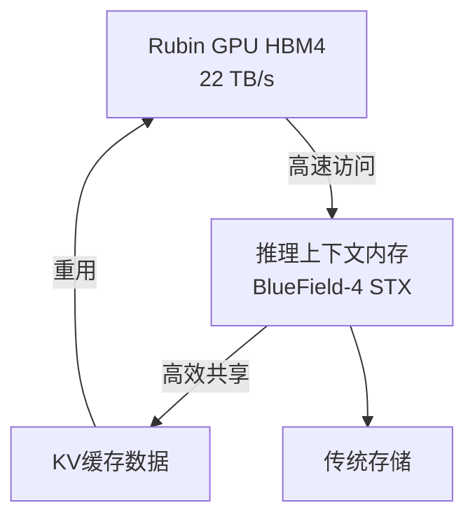
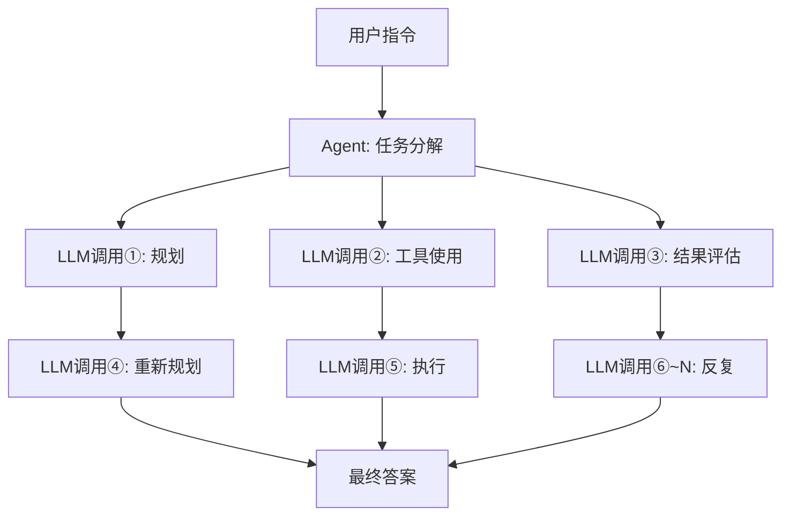

## 前言：为何推理成本是当前的关键问题

进入2026年，围绕AI的讨论已迅速从“模型性能”转向“推理成本的经济性”。大型语言模型（LLM）的能力已毋庸置疑，但在实际商业部署中，“每代币（token）的推理成本”成为了瓶颈。

特别是Agent型AI，为了完成一个任务需要进行数百至数千次的LLM调用。这带来的成本远超简单查询，使得大规模扩展变得困难。

NVIDIA首席执行官Jensen Huang在2026年3月的GTC 2026主旨演讲中，精辟地概括了这一状况。他表示：“如果它们拥有更大的容量，就能生成更多的代币，从而增加收入。现在，Agent型应用正在生成另一个Agent来完成一个又一个任务，生成的代币数量正在爆炸式增长。”他强调了高速、低成本推理基础设施的重要性。

NVIDIA为此给出的答案是 **Vera Rubin** 平台。该平台首次亮相于CES 2026（2026年1月），并在GTC 2026（2026年3月）上公布了更多细节。这款下一代AI基础设施号称与之前的Blackwell相比，推理成本最多可降低十分之一，引起了业界的广泛关注。

本文将深入探讨Vera Rubin的架构，分析其能够实现如此大幅成本降低的原因，并展望其对Agent型AI未来可能产生的影响。

---

## Vera Rubin 是什么：7芯片集成的“AI超级计算机”

Vera Rubin并非单一GPU芯片，而是**七种专用芯片经过极致协同设计（co-design）的集成AI平台**。NVIDIA称之为“Extreme Co-Design”。在GTC 2026上，NVIDIA正式确认于2025年12月以约200亿美元收购Groq，Groq 3 LPU作为第七种芯片加入了该平台。

构成该平台的七种芯片如下：

| 芯片 | 作用 |
|--------|------|
| **Vera CPU** | 专用AI定制CPU（88颗Olympus核心） |
| **Rubin GPU** | AI计算核心（50 PFLOPS NVFP4） |
| **NVLink 6 Switch** | GPU间高速通信（3.6 TB/s） |
| **ConnectX-9 SuperNIC** | 网络处理 |
| **BlueField-4 DPU** | 数据处理/推理上下文内存 |
| **Spectrum-6 Ethernet Switch** | 以太网通信 |
| **Groq 3 LPU** | 低延迟推理加速器（新增） |

整个系统以机架为单位进行集成，其形态为 **Vera Rubin NVL72**。每个机架集成了72颗Rubin GPU和36颗Vera CPU。对于更大规模的部署，还提供了 **Vera Rubin POD**，一种由40个机架组成的配置，可提供60 ExaFLOPS的计算能力。

---

## Vera CPU：AI专用设计的独有处理器

Vera Rubin与传统平台的一个显著区别在于，它采用了**NVIDIA自主设计的定制CPU“Vera”**。

Vera搭载了 **88颗Olympus核心**。Olympus是基于ARMv9.2指令集，由NVIDIA自主设计的核心，专为AI数据中心工作负载进行了优化。每个核心通过“空间多线程（Spatial Multithreading）”技术并行处理2个线程，总共提供 **176个线程** 的处理能力。L3缓存增加了40%至162MB，晶体管数量达到2270亿，是上一代的2.2倍。

值得注意的是FP8精度支持。Vera CPU是业界首款原生支持FP8的CPU，能够以低精度数值格式统一处理整个AI工作负载。

在内存方面，它支持高达 **1.5TB的SOCAMM LPDDR5X** 内存，提供 **1.2 TB/s** 的内存带宽。通过将内存总线宽度扩展到1024位，并将速度提升至9600MT/s，实现了比上一代高2.5倍的带宽。更重要的是与Rubin GPU的连接。通过**第二代NVLink-C2C（Chip-to-Chip）**，CPU-GPU之间实现了 **1.8 TB/s** 的一致性带宽。这比PCIe Gen 6快7倍。

### 为何需要定制CPU

在传统的AI服务器中，通常使用通用CPU。然而，在LLM推理中，CPU往往成为瓶颈。这是因为主机的内存带宽和连接速度跟不上GPU的处理能力。

NVIDIA认识到LLM推理受限于内存带宽和互连，因此通过自主设计CPU来优化整个系统。CPU-GPU之间的高速一致性链接最小化了数据传输开销，提高了GPU的利用率。

---

## Rubin GPU：专为推理设计的下一代计算引擎

Rubin GPU集成了多项针对AI推理的创新。

### 主要规格

| 项目 | 值 |
|------|-----|
| NVFP4推理性能 | **50 PFLOPS**（Blackwell的5倍） |
| NVFP4训练性能 | **35 PFLOPS**（Blackwell的3.5倍） |
| HBM4内存 | **288GB**（每颗） |
| HBM4内存带宽 | **22 TB/s** |
| NVLink 6带宽 | **3.6 TB/s**（每颗GPU） |
| 晶体管数量 | **3,360亿** |

特别值得关注的是 **HBM4** 的采用。与上一代的HBM3相比，内存带宽提升了约2.8倍，直接解决了LLM推理受内存带宽限制的问题。

### NVFP4与第三代Transformer Engine

Rubin GPU集成了**第三代Transformer Engine**，并利用了NVFP4这种新的低精度数值格式。NVFP4的算术密度比Blackwell采用的NVFP8更高，在保持精度的同时实现了大幅度的吞吐量提升。NVIDIA通过将这种低精度执行深度集成到架构和软件栈中，实现了超越单纯FLOPS增长的实际吞吐量提升。

---

## NVLink 6：突破带宽瓶颈的通信基础设施

LLM的推理，特别是Mixture-of-Experts（MoE）模型和多GPU环境，**GPU间的通信带宽** 对性能至关重要。

与上一代（NVLink 5）相比，NVLink 6的**带宽提升了一倍**。

| 指标 | NVLink 5 | NVLink 6 |
|------|----------|----------|
| 每交换机带宽 | 1,800 GB/s | **3,600 GB/s** |
| 每GPU带宽 | 约1.8 TB/s | **3.6 TB/s** |
| NVL72机架总计 | — | **260 TB/s** |

NVL72机架提供的260 TB/s的内部带宽，为高效推理大规模MoE模型提供了充足的规模。

---

## Groq 3 LPU：低延迟推理加速器

GTC 2026的一大惊喜是将Groq的LPU（Language Processing Unit）技术集成到Vera Rubin平台。NVIDIA于2025年12月24日以约200亿美元收购了Groq，并获得了其高级员工和Groq LPU技术的非独占许可。

### GPU与LPU的角色分配

Vera Rubin系统中，Rubin和Groq分担推理过程。


- **Rubin GPU**: 负责预填充处理和解码注意力处理。
- **Groq 3 LPU**: 负责前馈网络（FFN）的执行。

这种分工使每个芯片都能专注于其最擅长的处理。

### Groq 3 LPX 机架规格

GTC 2026发布的**Groq 3 LPX 机架** 搭载256颗LPU。

| 项目 | 值 |
|------|-----|
| SRAM容量（每芯片） | **500MB** |
| SRAM带宽（每芯片） | **150 TB/s** |
| 扩展带宽（每芯片） | **2.5 TB/s** |
| 片上SRAM总容量（机架） | **128GB** |
| 扩展带宽（机架） | **640 TB/s** |

Groq 3的设计侧重于带宽而非容量，每颗芯片拥有约80 TB/s的带宽。这种以SRAM为中心的、高带宽的设计实现了FFN处理中的低延迟。

### 集成效果

VeraRubin与Groq LPX的结合，使得**千亿参数模型的推理吞吐量相比单独的Rubin GPU最多提高35倍**，**每兆瓦的吞吐量增加35倍**。这无需对CUDA平台进行大幅修改，即可通过将LPU用作高度专业的解码加速器来实现。

---

## 推理上下文内存存储：Agent型AI的专属优化

Vera Rubin被设计为“Agent型AI的基础”，其重要功能之一是**推理上下文内存存储平台**。

### 新的内存层级

NVIDIA利用BlueField-4 DPU，在GPU和传统存储之间构建了一个新的内存层级。



BlueField-4 STX存储机架充当“专用上下文内存”，用于保持AI Agent在处理大规模多轮对话时的上下文一致性。将KV缓存数据卸载到BlueField-4芯片，使得整个AI推理基础设施能够共享和重用缓存数据，将推理吞吐量**最多提高5倍**。

### 对Agent型AI的影响

Agent型AI的计算模式与简单查询根本不同。



一次指令可能产生数十到数百次LLM调用，每次调用都具有长上下文。推理上下文内存存储通过高效管理KV缓存，改善了Agent型AI的整体吞吐量和成本效益。

---

## 10倍成本降低的机制：理解数值的准确含义

理解NVIDIA声称的“推理成本降低十分之一”的具体条件至关重要。

### 主要改进因素

10倍成本降低是多项技术创新综合作用的结果。

```
HBM4内存带宽提升：约 2.8倍
NVLink 6吞吐量提升：约 2倍
NVFP4 Tensor Core性能提升：约 5倍
Groq LPU集成带来的FNN处理效率提升：额外因素
```

### 电力效率的显著提升

Jensen Huang在主旨演讲中展示了一个令人印象深刻的数字。“在Blackwell世代，我们可以在1GW的数据中心每秒生成2200万个代币。而在Vera Rubin上，同样的电力可以每秒生成7亿个代币。这在两年内提高了350倍。”

| 指标 | Blackwell | Vera Rubin | 提升倍数 |
|------|-----------|------------|---------|
| 1GW每秒代币数 | 2200万 | **7亿** | **约32倍** |
| 代币成本（长上下文） | 基準 | 最大1/10 | **最大10倍** |
| 每瓦推理吞吐量 | 基準 | 10倍 | **10倍** |
| MoE训练GPU数量 | 基準 | 1/4 | **4倍效率化** |

### 现实的期望值

同时，现实的评估也很重要。10倍的成本降低是在“长上下文、长输出”的特定条件下实现的基准测试结果。对于**短上下文的密集模型（dense model）推理，2-3倍的提升是比较现实的预期**。

---

## NVL72机架：系统整体性能

Vera Rubin NVL72是各组件集成的机架级系统。

### NVL72规格总结

| 项目 | 规格 |
|------|------|
| GPU配置 | Rubin GPU × 72颗 |
| CPU配置 | Vera CPU × 36颗 |
| 总NVFP4推理性能 | **3.6 ExaFLOPS** |
| 总HBM4容量 | **20.7 TB** |
| 总HBM4带宽 | **1.6 PB/s**（每秒拍字节） |
| NVLink 6总带宽 | **260 TB/s** |

### Vera Rubin POD：数据中心规模部署

更大规模的配置是 **Vera Rubin POD**，由40个机架组成。

| 项目 | 规格 |
|------|------|
| 总GPU数量 | 2,880颗 |
| 总计算性能 | **60 ExaFLOPS** |
| 构成组件 | 1,300,000+ |

POD是NVIDIA自称为“AI工厂”的下一代数据中心的基本单元。

---

## 与Blackwell对比：代际演进

Vera Rubin 定位在NVIDIA Blackwell之后。整理各代主要改进点。

| 项目 | Blackwell | Vera Rubin | 提升倍数 |
|------|-----------|------------|---------|
| GPU推理性能（NVFP4） | 10 PFLOPS | **50 PFLOPS** | **5倍** |
| GPU训练性能 | 10 PFLOPS | **35 PFLOPS** | **3.5倍** |
| GPU间带宽 | 1,800 GB/s | **3,600 GB/s** | **2倍** |
| HBM代 | HBM3 | **HBM4** | **约2.8倍** |
| CPU | 通用/Grace | **Vera（Olympus 88核心）** | — |
| 低延迟推理 | — | **Groq 3 LPU集成** | — |
| 训练GPU数量（MoE） | 基準 | **减少1/4** | **4倍** |
| 代币成本 | 基準 | **最大1/10** | **最大10倍** |

---

## 部署时间线与主要合作伙伴

### 提供时间表

NVIDIA计划于**2026年下半年开始Vera Rubin的量产和出货**。在GTC 2026（2026年3月16-19日）时，Vera Rubin已被确认处于“全面生产状态”。

### 初期部署合作伙伴

以下公司被公布为首批提供基于Vera Rubin的云服务的合作伙伴：

- **超大规模云服务商**: AWS, Google Cloud, Microsoft Azure, Oracle Cloud Infrastructure（OCI）
- **专业云服务商**: CoreWeave, Lambda, Nebius, Nscale

Jensen Huang表示：“到2027年底，Blackwell和Rubin的累计订单将超过1万亿美元”，这表明Vera Rubin被定位为数据中心投资的核心。

---

## 技术挑战与未来展望

### 功耗与数据中心投资

NVL72机架拥有巨大的计算能力，但功耗也相当可观。预计2026年，超大规模云服务商的数据中心设备投资总额将超过650亿美元。引入Vera Rubin需要对电力和冷却基础设施进行大规模投资。

### 软件生态系统的建设

尽管NVIDIA声称Groq 3 LPU的集成无需对CUDA平台进行大幅修改，但对软件栈（CUDA库、推理框架）的优化依然重要。NVIDIA正通过NIM（NVIDIA Inference Microservices）等方式进行应对。

### 下一代“Vera Rubin Ultra”

在GTC 2026上，还预告了下一代**Vera Rubin Ultra**，暗示NVIDIA将继续保持年度周期性的平台进化。

---

## 总结：迈向AI基础设施的新阶段

NVIDIA Vera Rubin不仅仅是“更快的GPU”。它是集Vera CPU这一独有处理器、HBM4带来的大幅内存带宽提升、NVLink 6实现的GPU间通信翻倍、与Groq 3 LPU集成的低延迟推理、以及通过推理上下文内存存储进行的KV缓存管理——这七种芯片和相关系统经过极致协同设计的集成AI平台。

在长上下文条件下，最多可降低10倍的推理成本、MoE模型训练所需的GPU数量减少四分之一、同一电力下350倍的代币生成能力，从根本上改变了Agent型AI的经济可行性。

在2026年，Agent型AI正逐渐全面应用于企业自动化流程，推理成本直接关系到业务的盈利能力。Vera Rubin将于2026年下半年开始量产，这将改写成本方程。AI的实际应用，不仅取决于模型的智能，更取决于驱动它们的成本效益。从这个角度来看，Vera Rubin将成为2026年标志性的重要基础设施创新。

---

## 参考文献

| 标题 | 信息来源 | 日期 | URL |
|:---------|:-------|:-----|:----|
| NVIDIA Kicks Off the Next Generation of AI With Rubin — Six New Chips, One Incredible AI Supercomputer | NVIDIA Newsroom | 2026/03/16 | https://nvidianews.nvidia.com/news/rubin-platform-ai-supercomputer |
| NVIDIA Vera Rubin Opens Agentic AI Frontier | NVIDIA Newsroom | 2026/03/16 | https://nvidianews.nvidia.com/news/nvidia-vera-rubin-platform |
| Inside the NVIDIA Vera Rubin Platform: Six New Chips, One AI Supercomputer | NVIDIA Technical Blog | 2026/03/16 | https://developer.nvidia.com/blog/inside-the-nvidia-rubin-platform-six-new-chips-one-ai-supercomputer/ |
| Inside NVIDIA Groq 3 LPX: The Low-Latency Inference Accelerator for the NVIDIA Vera Rubin Platform | NVIDIA Technical Blog | 2026/03/16 | https://developer.nvidia.com/blog/inside-nvidia-groq-3-lpx-the-low-latency-inference-accelerator-for-the-nvidia-vera-rubin-platform/ |
| NVIDIA Vera Rubin POD: Seven Chips, Five Rack-Scale Systems, One AI Supercomputer | NVIDIA Technical Blog | 2026/03/16 | https://developer.nvidia.com/blog/nvidia-vera-rubin-pod-seven-chips-five-rack-scale-systems-one-ai-supercomputer/ |
| Infrastructure for Scalable AI Reasoning | NVIDIA官方 | 2026/03 | https://www.nvidia.com/en-us/data-center/technologies/rubin/ |
| Nvidia launches Vera Rubin NVL72 AI supercomputer at CES | Tom's Hardware | 2026/01/06 | https://www.tomshardware.com/pc-components/gpus/nvidia-launches-vera-rubin-nvl72-ai-supercomputer-at-ces-promises-up-to-5x-greater-inference-performance-and-10x-lower-cost-per-token-than-blackwell-coming-2h-2026 |
| GTC 2026: Nvidia Unveils Vera Rubin AI Platform, Eyes \$1T by 2027 | Data Center Knowledge | 2026/03/16 | https://www.datacenterknowledge.com/data-center-chips/gtc-2026-nvidia-unveils-vera-rubin-ai-platform-eyes-1t-by-2027 |
| Nvidia GTC 2026: CEO Jensen Huang sees \$1 trillion in orders for Blackwell and Vera Rubin through '27 | CNBC | 2026/03/16 | https://www.cnbc.com/2026/03/16/nvidia-gtc-2026-ceo-jensen-huang-keynote-blackwell-vera-rubin.html |
| Nvidia's Rubin platform aims to cut AI training, inference costs | CIO Dive | 2026/03 | https://www.ciodive.com/news/nvidia-rubin-cut-ai-training-inference-costs/808915/ |
| NVIDIA Vera Rubin NVL72 Detailed: 72 GPUs, 36 CPUs, 260 TB/s Scale-Up Bandwidth | VideoCardz | 2026/01 | https://videocardz.com/newz/nvidia-vera-rubin-nvl72-detailed-72-gpus-36-cpus-260-tb-s-scale-up-bandwidth |
| Decoding the Future of Inference At NVIDIA: Groq LPUs Join Vera Rubin Platform | ServeTheHome | 2026/03/16 | https://www.servethehome.com/decoding-the-future-of-inference-at-nvidia-groq-lpus-join-vera-rubin-platform-for-low-latency-inference/ |
| Nvidia Boasts 7 Chips in Production for Vera Rubin Platform, Including Groq 3 LPU | HPCwire | 2026/03/16 | https://www.hpcwire.com/2026/03/16/nvidia-boasts-7-chips-in-production-for-vera-rubin-platform-including-groq-3-lpu/ |
| NVIDIA Launches New Vera CPU: 88 Olympus Cores Designed From Scratch for AI | Knowledge Hub Media | 2026/01 | https://knowledgehubmedia.com/nvidia-launches-new-vera-cpu-88-olympus-cores-designed-from-scratch-for-ai/ |
| NVIDIA GTC 2026: Rubin GPUs, Groq LPUs, Vera CPUs, and What NVIDIA Is Building for Trillion-Parameter Inference | StorageReview | 2026/03/16 | https://www.storagereview.com/news/nvidia-gtc-2026-rubin-gpus-groq-lpus-vera-cpus-and-what-nvidia-is-building-for-trillion-parameter-inference |

---

> 本文由 LLM 自动生成，内容可能存在错误。
