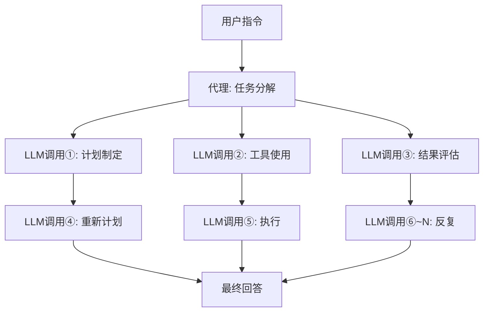

## 前言：为何推理成本如今成为焦点

进入2026年，围绕AI的讨论正迅速从“模型性能”转向“推理成本的经济性”。大型语言模型（LLM）的能力已毋庸置疑，但阻碍其在实际业务中大规模部署的瓶颈在于“每token的推理成本”。

特别是代理AI，其执行一项任务可能需要调用数百甚至数千次LLM。这带来的成本远超简单查询，使得规模化部署变得困难。

NVIDIA CEO Jensen Huang在2026年3月的GTC 2026主题演讲中，一针见血地指出了这一状况：“如果他们拥有更多算力，就能生成更多token，从而增加收入。如今，代理式应用可以生成其他代理来连续完成任务，生成的token数量正呈爆炸式增长。”他强调了高速、低成本推理基础设施的重要性。

NVIDIA对此给出的答案便是 **Vera Rubin** 平台。该平台于2026年CES（1月）首次亮相，并于2026年GTC（3月）公布了详细信息。这一下一代AI基础设施号称将与上一代Blackwell平台相比，推理成本降低高达10倍，引起了行业的高度关注。

本文将深入探讨Vera Rubin的架构，分析其实现如此大幅成本降低的原因，并展望其对代理AI未来可能产生的影响。

--- 

## Vera Rubin 是什么：7颗芯片集成的“AI超级计算机”

Vera Rubin并非单个GPU芯片，而是一个**高度协同设计的集成AI平台，集成了7种专用芯片**。NVIDIA称之为“Extreme Co-Design”。在GTC 2026上，NVIDIA正式确认了其在2025年12月以约200亿美元收购Groq，并将Groq 3 LPU作为第七颗芯片集成到该平台中。

该平台包含的7颗芯片如下：

| 芯片 | 作用 |
|---|---|
| **Vera CPU** | AI专用定制CPU（88颗Olympus核心） |
| **Rubin GPU** | AI计算核心（50 PFLOPS NVFP4） |
| **NVLink 6 Switch** | GPU间高速通信（3.6 TB/s） |
| **ConnectX-9 SuperNIC** | 网络处理 |
| **BlueField-4 DPU** | 数据处理/推理上下文内存 |
| **Spectrum-6 Ethernet Switch** | 以太网通信 |
| **Groq 3 LPU** | 低延迟推理加速器（新增） |

整个系统以机架为单位进行集成，其形态为 **Vera Rubin NVL72**。配置为每个机架集成了72颗Rubin GPU和36颗Vera CPU。对于更大规模的部署，还提供了 **Vera Rubin POD**，一种包含40个机架的配置，提供60 exaFLOPS的计算能力。

--- 

## Vera CPU：AI专用设计的自主研发处理器

Vera Rubin与先前平台的一个显著区别是采用了**NVIDIA自主设计的定制CPU“Vera”**。

Vera集成了**88颗Olympus核心**。Olympus是基于ARMv9.2指令集，由NVIDIA自主设计的核心，专门针对AI数据中心工作负载进行了优化。每个核心通过“空间多线程（Spatial Multithreading）”技术并行处理2个线程，总计提供**176个线程**的处理能力。L3缓存增加40%至162MB，晶体管数量达到2270亿，比前代产品增加了2.2倍。

值得注意的是FP8精度支持。Vera CPU是行业内首款原生支持FP8的CPU，能够以低精度数值格式统一处理整个AI工作负载。

在内存方面，它支持高达**1.5TB的SOCAMM LPDDR5X**内存，提供**1.2 TB/s**的内存带宽。通过将内存总线宽度扩展到1024位并提升速度至9600MT/s，实现了比前代产品高2.5倍的带宽。更重要的是与Rubin GPU的连接：通过**第二代NVLink-C2C（Chip-to-Chip）**，CPU与GPU之间的连通带宽达到**1.8 TB/s**的相干带宽，这比PCIe Gen 6快7倍。

### 为何需要定制CPU

在传统的AI服务器中，通常使用通用CPU。然而，在LLM推理过程中，CPU往往成为瓶颈。主机的内存带宽和连接速度难以跟上GPU的处理能力。

NVIDIA认识到LLM推理受到内存带宽和互连的限制，因此通过自主设计CPU来优化整个系统。CPU与GPU之间的高速相干链路最大限度地减少了数据传输开销，提高了GPU的利用率。

--- 

## Rubin GPU：专为推理优化的下一代计算引擎

Rubin GPU集成了多项针对AI推理的创新。

### 主要规格

| 项目 | 值 |
|---|---|
| NVFP4推理性能 | **50 PFLOPS**（Blackwell的5倍） |
| NVFP4训练性能 | **35 PFLOPS**（Blackwell的3.5倍） |
| HBM4内存 | **288GB**（每颗） |
| HBM4内存带宽 | **22 TB/s** |
| NVLink 6带宽 | **3.6 TB/s**（每颗GPU） |
| 晶体管数量 | **3,360亿** |

尤其值得关注的是**HBM4**的采用。与上一代HBM3相比，内存带宽提升了约2.8倍，直接解决了LLM推理受限于内存带宽的问题。

### NVFP4与第三代Transformer Engine

Rubin GPU搭载了**第三代Transformer Engine**，并利用一种名为NVFP4的新型低精度数值格式。NVFP4比Blackwell采用的NVFP8拥有更高的算术密度，在保持精度的同时实现了显著的吞吐量提升。NVIDIA通过将这种低精度执行深度集成到架构和软件栈中，实现了超越单纯FLOPS增加的实际吞吐量提升。

--- 

## NVLink 6：突破带宽瓶颈的通信基础设施

在LLM推理中，特别是在混合专家（MoE）模型和多GPU环境中，**GPU间的通信带宽**直接影响性能。

NVLink 6与前一代（NVLink 5）相比，**带宽翻倍**。

| 指标 | NVLink 5 | NVLink 6 |
|---|---|---|
| 每交换机带宽 | 1,800 GB/s | **3,600 GB/s** |
| 每GPU带宽 | 约1.8 TB/s | **3.6 TB/s** |
| NVL72机架整体 | — | **260 TB/s** |

NVL72机架提供的260 TB/s内部带宽，足以支持大规模MoE模型的高效推理。

--- 

## Groq 3 LPU：低延迟推理加速器

GTC 2026最大的惊喜之一是将Groq的LPU（Language Processing Unit）技术集成到Vera Rubin平台。NVIDIA于2025年12月24日以约200亿美元收购Groq，并聘用了其核心员工，获得了Groq LPU技术的非独占许可。

### GPU与LPU的角色分工

Vera Rubin系统将推理过程分配给Rubin和Groq。


- **Rubin GPU**: 负责预填充处理和解码注意力处理。
- **Groq 3 LPU**: 负责前馈网络（FFN）的执行。

这种分工使得每颗芯片都能专注于其最擅长的处理。

### Groq 3 LPX 机架规格

GTC 2026上发布的**Groq 3 LPX 机架**配备了256颗LPU。

| 项目 | 值 |
|---|---|
| SRAM容量（每颗芯片） | **500MB** |
| SRAM带宽（每颗芯片） | **150 TB/s** |
| 扩展带宽（每颗芯片） | **2.5 TB/s** |
| 片上SRAM总容量（机架） | **128GB** |
| 扩展带宽（机架） | **640 TB/s** |

Groq 3的设计侧重于带宽而非容量，每颗芯片约有80 TB/s的带宽。这种以SRAM为中心的高带宽设计，实现了FFN处理的低延迟。

### 集成效果

Vera Rubin与Groq LPX的组合，使得**三万亿参数模型的推理吞吐量相比仅使用Rubin GPU提升高达35倍**，并且**每兆瓦的吞吐量增加35倍**。这无需对CUDA平台进行重大修改，即可将LPU作为高度优化的解码加速器进行利用。

--- 

## 推理上下文内存存储：代理AI的专属优化

Vera Rubin被设计为“代理AI的基础”这一点，体现在其一项重要功能上：**推理上下文内存存储平台**。

### 新的内存层次结构

NVIDIA利用BlueField-4 DPU，在GPU和传统存储之间构建了一个新的内存层次结构。


BlueField-4 STX存储机架作为“专用上下文内存”，用于保持AI代理在进行大规模多轮对话时的上下文一致性。通过将KV缓存数据卸载到BlueField-4芯片，使得AI推理基础设施能够共享和重用缓存数据，从而将推理吞吐量**提升高达5倍**。

### 对代理AI的影响

代理AI具有与简单查询根本不同的计算模式。



一个指令可能产生数十到数百次LLM调用，每次调用都包含较长的上下文。推理上下文内存存储通过高效管理KV缓存，显著改善了代理AI的整体吞吐量和成本效益。

--- 

## 10倍成本削减的机制：准确解读数字

理解NVIDIA宣称的“推理成本降低10倍”在何种条件下实现至关重要。

### 主要改进因素

10倍的成本削减是多项技术创新复合效应的结果。

```
HBM4内存带宽提升：约 2.8倍
NVLink 6吞吐量提升：约 2倍
NVFP4 Tensor Core性能提升：约 5倍
Groq LPU集成带来的FNN处理效率提升：额外因素
```

### 电力效率的显著提升

Jensen Huang在主题演讲中展示了一个令人印象深刻的数据：“在Blackwell世代，我们每1GW的数据中心可以每秒生成2200万个token。在Vera Rubin上，同样的电力可以每秒生成7亿个token。这在两年内实现了350倍的提升。”

| 指标 | Blackwell | Vera Rubin | 提升倍数 |
|---|---|---|---|
| 每1GW token/秒 | 2,200万 | **7亿** | **约32倍** |
| token成本（长上下文） | 基准 | 最高1/10 | **最高10倍** |
| 每瓦推理吞吐量 | 基准 | 10倍 | **10倍** |
| MoE训练GPU数量 | 基准 | 1/4 | **4倍效率** |

### 现实的预期值

另一方面，现实的评估同样重要。10倍的成本削减是在“长上下文、长输出”这一特定条件下达成的基准测试结果。对于“短上下文、密集模型（dense model）”的推理，**2-3倍的提升**是更现实的预期。

--- 

## NVL72机架：系统整体性能

Vera Rubin NVL72是一个集成了所有组件的机架规模系统。

### NVL72规格总结

| 项目 | 规格 |
|---|---|
| GPU配置 | Rubin GPU × 72颗 |
| CPU配置 | Vera CPU × 36颗 |
| 总NVFP4推理性能 | **3.6 ExaFLOPS** |
| 总HBM4容量 | **20.7 TB** |
| 总HBM4带宽 | **1.6 PB/s**（Petabyte/s） |
| NVLink 6总带宽 | **260 TB/s** |

### Vera Rubin POD：数据中心规模部署

更大规模的配置是 **Vera Rubin POD**，由40个机架组成。

| 项目 | 规格 |
|---|---|
| GPU总数 | 2,880颗 |
| 总计算性能 | **60 ExaFLOPS** |
| 组成组件 | 超过1,300,000个 |

POD被NVIDIA称为下一代数据中心的“AI工厂”的基本单元。

--- 

## 与Blackwell的比较：世代进化

Vera Rubin是NVIDIA Blackwell之后的下一代产品。整理各世代的主要改进点。

| 项目 | Blackwell | Vera Rubin | 提升倍数 |
|---|---|---|---|
| GPU推理性能（NVFP4） | 10 PFLOPS | **50 PFLOPS** | **5倍** |
| GPU训练性能 | 10 PFLOPS | **35 PFLOPS** | **3.5倍** |
| GPU间带宽 | 1,800 GB/s | **3,600 GB/s** | **2倍** |
| HBM世代 | HBM3 | **HBM4** | **约2.8倍** |
| CPU | 通用/Grace | **Vera（Olympus 88核心）** | — |
| 低延迟推理 | — | **Groq 3 LPU集成** | — |
| 训练GPU数量（MoE） | 基准 | **减少1/4** | **4倍** |
| token成本 | 基准 | **最高1/10** | **最高10倍** |

--- 

## 部署时间线与主要合作伙伴

### 提供时间表

NVIDIA计划于**2026年下半年开始**Vera Rubin的**量产和交付**。GTC 2026（2026年3月16-19日）期间，Vera Rubin已确认处于“全面生产状态”。

### 首批部署合作伙伴

以下公司已被宣布为首批提供基于Vera Rubin的云服务的合作伙伴：

- **超大规模云服务商**: AWS、Google Cloud、Microsoft Azure、Oracle Cloud Infrastructure（OCI）
- **专业云服务商**: CoreWeave、Lambda、Nebius、Nscale

Jensen Huang表示：“到2027年底，Blackwell和Rubin的累计订单将超过1万亿美元”，这表明Vera Rubin将成为数据中心投资的核心。

--- 

## 技术挑战与未来展望

### 功耗与数据中心投资

NVL72机架虽然提供了巨大的计算能力，但其功耗也相当可观。2026年，超大规模云服务商的数据中心设备投资预计将超过650亿美元，引入Vera Rubin需要对电力和冷却基础设施进行大规模投资。

### 软件生态系统的完善

尽管NVIDIA表示Groq 3 LPU的集成无需对CUDA平台进行重大修改，但软件栈（CUDA库、推理框架）的优化仍然至关重要。NVIDIA正通过NIM（NVIDIA Inference Microservices）等方式进行应对。

### 下一代“Vera Rubin Ultra”

GTC 2026上还预告了下一代**Vera Rubin Ultra**，暗示NVIDIA将保持其平台年度迭代的进化节奏。

--- 

## 总结：迈向AI基础设施的新阶段

NVIDIA Vera Rubin不仅仅是“更快的GPU”。它是一个集成了Vera CPU（自主研发处理器）、HBM4（大幅提升内存带宽）、NVLink 6（GPU间通信翻倍）、Groq 3 LPU（低延迟推理集成）、推理上下文内存存储（KV缓存管理）的**高度协同设计的集成AI平台，集成了7颗芯片及相关系统**。

最高10倍的推理成本降低（长上下文条件）、MoE模型训练所需的GPU数量减少至四分之一、以及同一电力下350倍的token生成能力，将从根本上改变代理AI的经济可行性。

随着代理AI开始全面应用于企业自动化流程，到2026年，推理成本已成为直接影响业务盈利能力的关键问题。Vera Rubin将于2026年下半年开始量产，届时将改写这一成本方程。AI的实际应用不仅取决于模型的智能，也取决于驱动它的基础设施的经济性。从这个角度来看，Vera Rubin将是2026年具有代表性的重要基础设施创新。

--- 

## 参考文献

| 标题 | 信息源 | 日期 | URL |
|:---------|:-------|:-----|:----|
| NVIDIA Kicks Off the Next Generation of AI With Rubin — Six New Chips, One Incredible AI Supercomputer | NVIDIA Newsroom | 2026/03/16 | https://nvidianews.nvidia.com/news/rubin-platform-ai-supercomputer |
| NVIDIA Vera Rubin Opens Agentic AI Frontier | NVIDIA Newsroom | 2026/03/16 | https://nvidianews.nvidia.com/news/nvidia-vera-rubin-platform |
| Inside the NVIDIA Vera Rubin Platform: Six New Chips, One AI Supercomputer | NVIDIA Technical Blog | 2026/03/16 | https://developer.nvidia.com/blog/inside-the-nvidia-rubin-platform-six-new-chips-one-ai-supercomputer/ |
| Inside NVIDIA Groq 3 LPX: The Low-Latency Inference Accelerator for the NVIDIA Vera Rubin Platform | NVIDIA Technical Blog | 2026/03/16 | https://developer.nvidia.com/blog/inside-nvidia-groq-3-lpx-the-low-latency-inference-accelerator-for-the-nvidia-vera-rubin-platform/ |
| NVIDIA Vera Rubin POD: Seven Chips, Five Rack-Scale Systems, One AI Supercomputer | NVIDIA Technical Blog | 2026/03/16 | https://developer.nvidia.com/blog/nvidia-vera-rubin-pod-seven-chips-five-rack-scale-systems-one-ai-supercomputer/ |
| Infrastructure for Scalable AI Reasoning | NVIDIA公式 | 2026/03 | https://www.nvidia.com/en-us/data-center/technologies/rubin/ |
| Nvidia launches Vera Rubin NVL72 AI supercomputer at CES | Tom's Hardware | 2026/01/06 | https://www.tomshardware.com/pc-components/gpus/nvidia-launches-vera-rubin-nvl72-ai-supercomputer-at-ces-promises-up-to-5x-greater-inference-performance-and-10x-lower-cost-per-token-than-blackwell-coming-2h-2026 |
| GTC 2026: Nvidia Unveils Vera Rubin AI Platform, Eyes \$1T by 2027 | Data Center Knowledge | 2026/03/16 | https://www.datacenterknowledge.com/data-center-chips/gtc-2026-nvidia-unveils-vera-rubin-ai-platform-eyes-1t-by-2027 |
| Nvidia GTC 2026: CEO Jensen Huang sees \$1 trillion in orders for Blackwell and Vera Rubin through '27 | CNBC | 2026/03/16 | https://www.cnbc.com/2026/03/16/nvidia-gtc-2026-ceo-jensen-huang-keynote-blackwell-vera-rubin.html |
| Nvidia's Rubin platform aims to cut AI training, inference costs | CIO Dive | 2026/03 | https://www.ciodive.com/news/nvidia-rubin-cut-ai-training-inference-costs/808915/ |
| NVIDIA Vera Rubin NVL72 Detailed: 72 GPUs, 36 CPUs, 260 TB/s Scale-Up Bandwidth | VideoCardz | 2026/01 | https://videocardz.com/newz/nvidia-vera-rubin-nvl72-detailed-72-gpus-36-cpus-260-tb-s-scale-up-bandwidth |
| Decoding the Future of Inference At NVIDIA: Groq LPUs Join Vera Rubin Platform | ServeTheHome | 2026/03/16 | https://www.servethehome.com/decoding-the-future-of-inference-at-nvidia-groq-lpus-join-vera-rubin-platform-for-low-latency-inference/ |
| Nvidia Boasts 7 Chips in Production for Vera Rubin Platform, Including Groq 3 LPU | HPCwire | 2026/03/16 | https://www.hpcwire.com/2026/03/16/nvidia-boasts-7-chips-in-production-for-vera-rubin-platform-including-groq-3-lpu/ |
| NVIDIA Launches New Vera CPU: 88 Olympus Cores Designed From Scratch for AI | Knowledge Hub Media | 2026/01 | https://knowledgehubmedia.com/nvidia-launches-new-vera-cpu-88-olympus-cores-designed-from-scratch-for-ai/ |
| NVIDIA GTC 2026: Rubin GPUs, Groq LPUs, Vera CPUs, and What NVIDIA Is Building for Trillion-Parameter Inference | StorageReview | 2026/03/16 | https://www.storagereview.com/news/nvidia-gtc-2026-rubin-gpus-groq-lpus-vera-cpus-and-what-nvidia-is-building-for-trillion-parameter-inference |

---

> 本文由 LLM 自动生成，内容可能存在错误。
